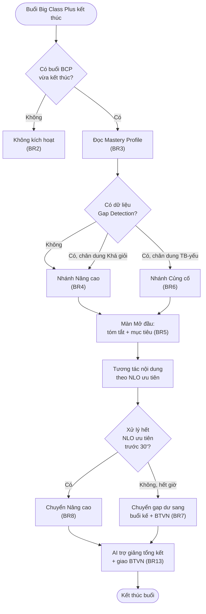

# AICNew-02 AI Bổ trợ 30 phút

> ⚠️ **Trạng thái: Bản dựng cho Prototype/Khảo sát tháng 9/2026.** Cùng bối cảnh với [AICNew-01 Big Class Plus](../big-class-plus/AICNew-01-big-class-plus.md) — phục vụ dựng prototype/demo cho khảo sát phụ huynh T9/2026. **CHƯA phải bản đã xác nhận đầy đủ để bàn giao Dev triển khai sản xuất.** Trước khi handoff chính thức, cần: (1) BOD/Product chốt hướng sau kết quả khảo sát, (2) PRD nền tảng "Adaptive Learning" (Mastery Profile, Routing Engine) phải tồn tại và đối chiếu ngược lại PRD này, (3) chốt các ngưỡng số còn để ngỏ ở mục "Giả định AI".
>
> ⚠️ **Tên gọi:** "AI Bổ trợ 30 phút" là tên tạm/nội bộ, chưa phải tên chính thức dùng trong content bán hàng. **KHÔNG** nhầm với "**AI Tutor**" (Concept 3.1) — sản phẩm gia sư AI 1:1 độc lập, trả phí riêng, không gắn sau buổi Big Class nào. Xem `00_context/glossary.md`.

---

## Metadata

| Field         | Value                                    |
|---------------|------------------------------------------|
| **PRD ID**    | AICNew-02                                |
| **Version**   | 1.1                                       |
| **Status**    | draft                                     |
| **Author**    | AI-assisted                               |
| **PO**        | Đặng Ngọc Lân                             |
| **Domain**    | ai-class-core                             |
| **Created**   | 2026-09-08                                |
| **Updated**   | 2026-09-08                                |
| **Ticket**    | AICNew-02                                 |
| **API Source** |                                           |

---

# Feature

**AI Bổ trợ 30 phút**

Buổi kèm 1-1 với AI, 30 phút, chạy mặc định ngay sau MỌI buổi Big Class Plus (Concept 1.2 — Edupia AI Class Plus). Hệ thống đọc Mastery Profile để xác định chân dung học sinh và rẽ vào 1 trong 2 nhánh: **Củng cố** (vá đúng lỗ hổng NLO vừa phát hiện ở buổi liền trước, dành cho học sinh trung bình/yếu hoặc chưa đủ dữ liệu) hoặc **Nâng cao** (mở rộng kiến thức, dành cho học sinh khá/giỏi). Đây là mắt xích nối tiếp vòng lặp cá nhân hoá: tiêu thụ tín hiệu Gap Detection từ [AICNew-01 Big Class Plus](../big-class-plus/AICNew-01-big-class-plus.md) và bàn giao lại cho BTVN Adaptive.

---

# 1. Tổng quan

## a. User Story

- **Là một (As a)** học sinh vừa hoàn thành buổi Big Class Plus
- **Tôi muốn (I want to)** được học bổ trợ 30 phút đúng với năng lực hiện tại của mình — vá đúng lỗ hổng nếu chưa vững, học nâng cao nếu đã vững — thay vì chương trình giống nhau cho mọi người
- **Để (So that)** không bị bỏ lại phía sau vì "không hiểu bài mà không ai giúp" (nhóm yếu), đồng thời không lãng phí thời gian/mất động lực (nhóm giỏi)

## b. Phạm vi

**In Scope**
- Tự động chuyển học sinh vào buổi bổ trợ ngay sau khi buổi Big Class Plus kết thúc.
- Đọc Mastery Profile để xác định chân dung và rẽ nhánh nội dung (Củng cố / Nâng cao).
- Xử lý trường hợp chưa đủ dữ liệu Mastery Profile.
- Ưu tiên NLO khi số lượng lỗ hổng vượt thời lượng buổi, bàn giao phần dư sang buổi kế tiếp + BTVN Adaptive.
- Tự động chuyển nhánh khi học sinh xử lý xong nội dung Củng cố trước thời hạn.
- Hiển thị tóm tắt kết quả buổi Big Class Plus + mục tiêu buổi bổ trợ.
- Cho phép thoát/tiếp tục giữa buổi.
- AI trợ giảng tổng kết cuối buổi + giao BTVN Adaptive.
- Ghi nhận kết quả tương tác vào Mastery Profile theo thời gian thực.

**Out of Scope**
- Cấu trúc/schema chi tiết Mastery Profile — thuộc PRD Adaptive Learning (nền tảng chung, ◆ Pending BOD).
- Cơ chế/thuật toán Routing Engine — thuộc PRD Adaptive Learning.
- Cơ chế khởi tạo Mastery Profile lần đầu cho học sinh mới — thuộc PRD Adaptive Learning.
- Nội dung NLO Taxonomy — thuộc tài liệu taxonomy riêng.
- Điểm danh, AI Voice, gán NLO cuối buổi của Big Class Plus — thuộc [AICNew-01](../big-class-plus/AICNew-01-big-class-plus.md).
- Sản phẩm "AI Tutor" (Concept 3.1) — sản phẩm độc lập khác, không liên quan.
- Hiển thị/thông báo kết quả cho phụ huynh (Parent Mode/Mastery Map) — thuộc PRD Parent Mode riêng.
- Nội dung bài tập cụ thể của BTVN Adaptive/AI Practice — feature này chỉ giao đúng NLO ưu tiên, không thiết kế nội dung luyện tập.
- Chấm phát âm/luyện nói chi tiết — thuộc AI Speak.

## c. Phụ thuộc liên service *(mức nghiệp vụ)*

- Cần **đọc Mastery Profile** (mastery tổng hợp toàn môn, đa buổi) từ nền tảng Adaptive Learning — vì đây là căn cứ duy nhất để xác định chân dung học sinh. *(Nền tảng này chưa có PRD chính thức — xem Note dưới.)*
- Cần **tín hiệu Gap Detection** (NLO "chưa đạt") từ [AICNew-01 Big Class Plus](../big-class-plus/AICNew-01-big-class-plus.md) — vì đây là nguồn xác định nội dung nhánh Củng cố. Buổi Big Class Plus phải hoàn tất và ghi xong tín hiệu trước khi feature này chạy.
- Cần **cơ chế chọn NLO ưu tiên (Routing Engine)** từ nền tảng Adaptive Learning — vì khi có nhiều NLO gap, feature này không tự quyết định thứ tự xử lý mà giao hoàn toàn cho Routing Engine.
- Cần **khả năng nhận bàn giao NLO ưu tiên** từ BTVN Adaptive/Edupia Practice — để giao đúng bài tập tương ứng cuối buổi.
- Cần **vai trò AI trợ giảng** (đã định hình ở AICNew-01) — để tổng kết cuối buổi, có thể cần mở rộng logic cho ngữ cảnh buổi bổ trợ.

> **Note (phụ thuộc liên service):** Tại thời điểm viết PRD này, 3/5 phụ thuộc trên (Mastery Profile, Routing Engine, BTVN Adaptive) chưa có PRD chính thức. Theo quyết định của PO (2026-09-08): PRD này viết độc lập, không chờ PRD Adaptive Learning hoàn tất; PRD Adaptive Learning (viết sau) sẽ tham khảo ngược lại thông tin từ PRD này.

## d. Quy ước

- **Mastery Profile được tham chiếu trong PRD này** luôn hiểu là giá trị **tổng hợp toàn môn, đa buổi, có decay** (không phải chỉ dữ liệu của một buổi riêng lẻ) — trừ khi ghi rõ khác.
- **"Không có dữ liệu gap"** = Mastery Profile chưa khởi tạo HOẶC không có NLO nào ở trạng thái "chưa đạt" khả dụng cho học sinh — cả hai trường hợp xử lý giống nhau (BR4).

---

# 2. Acceptance Criteria

**AC1:** Học sinh được chuyển thẳng vào màn Mở đầu buổi bổ trợ ngay sau khi điểm danh cuối buổi Big Class Plus hoàn tất, không cần thao tác kích hoạt thủ công. _(BR: AICNew-02-UC1-BR1)_

**AC2:** Học sinh không có buổi Big Class Plus vừa hoàn thành trong ngày thì không được đưa vào luồng AI Bổ trợ 30 phút. _(BR: AICNew-02-UC1-BR2)_

**AC3:** Học sinh có Mastery Profile đủ dữ liệu thì hệ thống chọn đúng nhánh (Nâng cao/Củng cố) tương ứng chân dung. _(BR: AICNew-02-UC1-BR3)_

**AC4:** Học sinh chưa có Mastery Profile hoặc không có NLO gap thì hệ thống hiển thị thẳng nội dung Nâng cao, không qua bước phân chân dung. _(BR: AICNew-02-UC1-BR4)_

**AC5:** Trước khi vào nội dung tương tác, học sinh thấy tóm tắt kết quả buổi Big Class Plus vừa học và mục tiêu buổi bổ trợ tương ứng nhánh đã chọn. _(BR: AICNew-02-UC1-BR5)_

**AC6:** Học sinh có NLO "chưa đạt" từ buổi liền trước thì nội dung Củng cố tập trung đúng NLO có priority cao nhất theo Routing Engine. _(BR: AICNew-02-UC2-BR6)_

**AC7:** Số NLO gap vượt quá thời lượng còn lại thì hệ thống chỉ xử lý NLO ưu tiên cao nhất; phần còn lại xuất hiện ở buổi kế tiếp và trong BTVN Adaptive giao cuối buổi hiện tại. _(BR: AICNew-02-UC2-BR7)_

**AC8:** Học sinh xử lý xong toàn bộ NLO ưu tiên trước khi hết 30 phút thì hệ thống tự động hiển thị nội dung Nâng cao cho thời gian còn lại, không kết thúc buổi sớm. _(BR: AICNew-02-UC2-BR8)_

**AC9:** Học sinh thoát và quay lại trong cùng buổi thấy đúng nội dung/vị trí đã dừng; đồng hồ 30 phút không cộng dồn thời gian đã thoát ra. _(BR: AICNew-02-UC2-BR9)_

**AC10:** Nhiều NLO khác kỹ năng cùng mức priority cao nhất thì nội dung buổi theo đúng thứ tự Routing Engine trả về, không có luật ưu tiên kỹ năng riêng. _(BR: AICNew-02-UC2-BR10)_

**AC11:** Buổi bổ trợ không hiển thị bất kỳ yêu cầu điểm danh hay trạng thái "phải hoàn thành" nào. _(BR: AICNew-02-UC3-BR11)_

**AC12:** Ngay sau mỗi tương tác, Mastery Profile của NLO tương ứng được cập nhật, kể cả khi buổi bị ngắt giữa chừng. _(BR: AICNew-02-UC3-BR12)_

**AC13:** Cuối buổi, học sinh nhận được nhận xét của AI trợ giảng và BTVN Adaptive tương ứng đúng các NLO đã xử lý trong buổi. _(BR: AICNew-02-UC3-BR13)_

---

# 3. Use Case

#### AICNew-02-UC1: Tự động khởi động buổi & xác định nhánh nội dung

**Actor:** Học sinh (hệ thống kích hoạt tự động)

**Description:** Ngay sau khi buổi Big Class Plus kết thúc, hệ thống tự động đưa học sinh vào buổi AI Bổ trợ 30 phút, đọc Mastery Profile để xác định nhánh nội dung phù hợp (Củng cố/Nâng cao), và hiển thị tóm tắt + mục tiêu buổi trước khi vào phần tương tác.

**Pre-condition:**
- Buổi Big Class Plus của học sinh đã kết thúc: điểm danh cuối buổi ghi nhận thành công và AI trợ giảng đã đưa nhận xét tổng kết (xem [AICNew-01](../big-class-plus/AICNew-01-big-class-plus.md))

**Post-condition:**
- Học sinh đang ở màn Mở đầu buổi bổ trợ, đã biết nhánh nội dung (Nâng cao/Củng cố) và mục tiêu buổi

**AC liên quan:** AC1, AC2, AC3, AC4, AC5

**Business Rule**

| ID | Business Rule | Business Logic |
|----|---------------|-----------------|
| AICNew-02-UC1-BR1 | Hệ thống PHẢI tự động chuyển học sinh sang buổi AI Bổ trợ 30 phút ngay sau khi buổi Big Class Plus kết thúc, không cần kích hoạt thủ công | - Sự kiện kích hoạt: buổi Big Class Plus kết thúc (điểm danh cuối buổi ghi nhận thành công). - Áp dụng cho mọi học sinh, mọi buổi Big Class Plus. |
| AICNew-02-UC1-BR2 | Hệ thống KHÔNG khởi chạy buổi AI Bổ trợ 30 phút nếu học sinh không có buổi Big Class Plus nào vừa kết thúc | - Điều kiện kiểm tra tại điểm bắt đầu của luồng tính năng: có bản ghi "buổi Big Class Plus vừa kết thúc" của học sinh hay không. - Không có → tính năng không xuất hiện, không có luồng truy cập độc lập. |
| AICNew-02-UC1-BR3 | Hệ thống PHẢI đọc Mastery Profile (tổng hợp toàn môn, đa buổi) để xác định chân dung Khá giỏi / Trung bình-yếu | - Đọc mastery trung bình các NLO liên quan từ Mastery Profile, so ngưỡng để phân chân dung. - *(Ngưỡng số cụ thể — xem Giả định AI Q1.)* |
| AICNew-02-UC1-BR4 | Khi Mastery Profile chưa khởi tạo hoặc không có tín hiệu Gap Detection nào được ghi nhận, hệ thống PHẢI bỏ qua bước xác định chân dung và chạy thẳng nội dung Nâng cao | - Điều kiện: Mastery Profile không tồn tại HOẶC danh sách NLO "chưa đạt" rỗng. - Rẽ thẳng nhánh Nâng cao, bỏ qua BR3. |
| AICNew-02-UC1-BR5 | Trước khi vào nội dung tương tác, hệ thống PHẢI hiển thị tóm tắt kết quả buổi Big Class Plus vừa học và mục tiêu buổi bổ trợ tương ứng nhánh đã chọn | - Lấy dữ liệu buổi Big Class Plus liền trước (điểm/kỹ năng) + nhánh đã chọn ở BR3/BR4. - Dựng nội dung tóm tắt + mục tiêu tương ứng. |

> **Note (BR2):** "Chặn" ở đây nghĩa là tính năng đơn giản không xuất hiện — không có màn hình thông báo lý do — vì điểm bắt đầu của luồng tính năng vốn chỉ kích hoạt nối tiếp buổi Big Class Plus (quyết định PO, 2026-09-08).

---

#### AICNew-02-UC2: Tương tác nội dung theo nhánh đã chọn

**Actor:** Học sinh

**Description:** Học sinh tương tác với nội dung học tập trong thời lượng 30 phút, tập trung vào NLO ưu tiên (nhánh Củng cố) hoặc nội dung mở rộng (nhánh Nâng cao); hệ thống xử lý các tình huống về giới hạn thời lượng và gián đoạn giữa buổi.

**Pre-condition:**
- Đã xác định nhánh nội dung (AICNew-02-UC1)

**Post-condition:**
- Học sinh đã xử lý xong nội dung ưu tiên trong thời lượng buổi (hoặc chuyển sang nội dung mở rộng nếu xong sớm)

**AC liên quan:** AC6, AC7, AC8, AC9, AC10

**Business Rule**

| ID | Business Rule | Business Logic |
|----|---------------|-----------------|
| AICNew-02-UC2-BR6 | Nhánh Củng cố PHẢI tập trung vào NLO ưu tiên cao nhất trong số NLO "chưa đạt" vừa phát hiện ở buổi Big Class Plus liền trước | - Tính `priority` từng NLO theo công thức Routing Engine (`priority = ppct_weight × (1−mastery) × prereq_boost`). - Chọn NLO ưu tiên cao nhất làm nội dung Củng cố. |
| AICNew-02-UC2-BR7 | Khi số NLO ưu tiên cần xử lý nhiều hơn thời lượng cho phép, hệ thống PHẢI ưu tiên xử lý NLO priority cao nhất; NLO còn lại PHẢI chuyển sang buổi bổ trợ kế tiếp và giao vào BTVN Adaptive | - So số NLO ưu tiên với thời lượng còn lại của buổi. - Vượt quá: xếp theo priority giảm dần, xử lý tới hết giờ, phần dư đẩy sang buổi kế tiếp + BTVN Adaptive. - *(Thời lượng ước tính mỗi NLO — xem Giả định AI Q2.)* |
| AICNew-02-UC2-BR8 | Khi học sinh xử lý hết NLO ưu tiên trước khi hết 30 phút, hệ thống PHẢI tự động chuyển sang nội dung Nâng cao/mở rộng | - Điều kiện: danh sách NLO ưu tiên (Củng cố) đã xử lý hết TRƯỚC khi hết giờ. - Chuyển sang cùng kho nội dung Nâng cao dùng cho chân dung Khá giỏi. |
| AICNew-02-UC2-BR9 | Khi học sinh thoát khỏi buổi bổ trợ giữa chừng, hệ thống PHẢI cho tiếp tục đúng tại điểm đã thoát khi quay lại; thời lượng 30 phút KHÔNG tính thời gian đã thoát ra | - Khi thoát: lưu vị trí/tiến trình hiện tại, tạm dừng đếm thời lượng. - Khi quay lại: khôi phục đúng vị trí, tiếp tục đếm thời lượng từ đó. |
| AICNew-02-UC2-BR10 | Khi nhiều NLO "chưa đạt" thuộc kỹ năng khác nhau cùng mức ưu tiên, hệ thống giao quyết định hoàn toàn cho Routing Engine | - Dùng nguyên kết quả/thứ tự Routing Engine trả về. - Không áp thêm luật ưu tiên loại kỹ năng riêng ở tầng nghiệp vụ feature này. |

---

#### AICNew-02-UC3: Kết thúc buổi & đồng bộ dữ liệu học tập

**Actor:** Học sinh, AI trợ giảng

**Description:** Khi buổi kết thúc (hết thời lượng hoặc hết nội dung), hệ thống tổng hợp kết quả, đảm bảo Mastery Profile đã được cập nhật liên tục trong suốt buổi, và giao bài tập tương ứng — không yêu cầu điểm danh như Big Class Plus.

**Pre-condition:**
- Buổi bổ trợ đang diễn ra (AICNew-02-UC2)

**Post-condition:**
- Mastery Profile đã cập nhật với NLO vừa xử lý; BTVN Adaptive tương ứng đã được giao; học sinh rời khỏi luồng

**AC liên quan:** AC11, AC12, AC13

**Business Rule**

| ID | Business Rule | Business Logic |
|----|---------------|-----------------|
| AICNew-02-UC3-BR11 | Buổi bổ trợ KHÔNG yêu cầu đánh dấu hoàn thành/điểm danh (khác Big Class Plus) | - Không có bước "đánh dấu hoàn thành" trong luồng. - Buổi được coi là đã diễn ra bất kể hoàn thành hết nội dung hay không — kể cả khi mất kết nối giữa buổi. |
| AICNew-02-UC3-BR12 | Hệ thống PHẢI ghi nhận kết quả (đúng/sai theo NLO) vào Mastery Profile ngay sau mỗi tương tác, không đợi tổng kết cuối buổi | - Mỗi lần hoàn tất một tương tác gắn với 1 NLO → gửi ngay tín hiệu cập nhật mastery của NLO đó. - Áp dụng cả khi buổi bị gián đoạn/mất kết nối (liên kết BR11). |
| AICNew-02-UC3-BR13 | Khi buổi kết thúc, AI trợ giảng PHẢI đưa nhận xét tổng kết và giao BTVN Adaptive đúng NLO đã xử lý trong buổi | - Tổng hợp danh sách NLO đã xử lý + trạng thái (cải thiện/còn gap). - Sinh nhận xét + danh sách BTVN Adaptive tương ứng. |

---

# 4. UI/UX Guidelines

## a. User Flow

## b. Wireframe

### Screen 1: Mở đầu buổi bổ trợ

| Thành phần | Chi tiết |
|------------|----------|
| **Screen** | Màn mở đầu, hiển thị ngay sau khi vào buổi bổ trợ |
| **Components** | - Tóm tắt kết quả buổi Big Class Plus vừa học - Thông báo nhánh (Nâng cao/Củng cố) - Nút bắt đầu |
| **Actions** | - Bấm bắt đầu → chuyển sang Screen 2 |

---

### Screen 2: Tương tác nội dung

| Thành phần | Chi tiết |
|------------|----------|
| **Screen** | Màn tương tác chính trong 30 phút |
| **Components** | - Khu vực hiển thị nội dung/câu hỏi theo NLO ưu tiên - Ô trả lời - Nút gợi ý - Thanh tiến trình thời lượng còn lại |
| **Actions** | - Trả lời → ghi nhận đúng/sai theo NLO (AICNew-02-UC3-BR12), chuyển nội dung tiếp theo |

---

### Screen 3: Tổng kết cuối buổi

| Thành phần | Chi tiết |
|------------|----------|
| **Screen** | Màn tổng kết, hiển thị khi buổi kết thúc |
| **Components** | - Danh sách NLO đã xử lý (đã cải thiện/còn gap) - Nhận xét của AI trợ giảng - Nút xem BTVN Adaptive |
| **Actions** | - Bấm xem BTVN → chuyển sang BTVN Adaptive; kết thúc buổi |

---

# Appendix

## Input gốc từ PO

> Xem toàn bộ Q&A khám phá tại [`00_context/AICNew-02-ai-bo-tro-30-phut.md`](../../../../00_context/AICNew-02-ai-bo-tro-30-phut.md) (Product Definition, Phase 0-7, hoàn tất 2026-09-08).

## Tài liệu tham khảo

- [AICNew-01 Big Class Plus](../big-class-plus/AICNew-01-big-class-plus.md) — nguồn phát tín hiệu Gap Detection (pre-condition bắt buộc)
- BDD: [`./bdd/`](./bdd/)
- Design spec: [`./design-spec/`](./design-spec/)
- Từ điển nghiệp vụ: [`00_context/glossary.md`](../../../../00_context/glossary.md)

## Giả định AI

> Độ vênh AI phát hiện khi đối chiếu Product Definition — cần PO chốt trước khi bàn giao Dev chính thức.

- **Q1 — [AI DRAFT] Ngưỡng phân chân dung Khá giỏi/Trung bình-yếu:** BR3 yêu cầu so mastery với một ngưỡng để phân chân dung, nhưng buổi khám phá chưa chốt con số cụ thể (vd mastery ≥ bao nhiêu % là "Khá giỏi"). **Cần PO chốt ngưỡng số** trước khi bàn giao dev.
- **Q2 — [AI DRAFT] Thời lượng ước tính mỗi NLO:** BR7 cần biết "còn đủ giờ xử lý thêm NLO hay không" nhưng chưa có ước tính thời gian trung bình cho mỗi NLO trong bối cảnh buổi 30 phút. **Cần PO/đội nội dung chốt định lượng** (hoặc quy tắc suy ra từ dữ liệu thực tế).
- **Q3 — [AI DRAFT] Hành vi khi hệ thống lỗi không khởi chạy được buổi:** BR1 mô tả trigger tự động nhưng chưa thảo luận trường hợp lỗi hệ thống khiến buổi không khởi chạy được (khác với BR2 — trường hợp không đủ điều kiện nghiệp vụ). **Cần PO xác nhận** hành vi kỳ vọng (thử lại, thông báo, hay bỏ qua).

---

# Change Log

> Hiện tại: **v1.1** (2026-09-08)

| Version | Date | Changes (UC/AC/BR bị ảnh hưởng) |
|---------|------|---------------------------------|
| 1.1 | 2026-09-08 | Auto-fix (`/review-context --fix`) — UC1: diễn đạt lại thuật ngữ kỹ thuật (BR1, BR2); UC3: diễn đạt lại thuật ngữ kỹ thuật (BR12), đổi tên nhất quán "Trợ giảng AI"→"AI trợ giảng" khớp AICNew-01; PRD-global: đổi tên nhất quán "Trợ giảng AI"→"AI trợ giảng". |
| 1.0 | 2026-09-08 | Bản đầu — sinh từ product-definition `00_context/AICNew-02-ai-bo-tro-30-phut.md`. |

---

<!--
  NEXT STEPS:
  Khi PRD được approve (status: approved), chạy:
  /generate-bdd "04_delivery/specs/ai-class-core/ai-bo-tro-30-phut/AICNew-02-ai-bo-tro-30-phut.md"
  để sinh BDD feature specs từ PRD này.
-->
