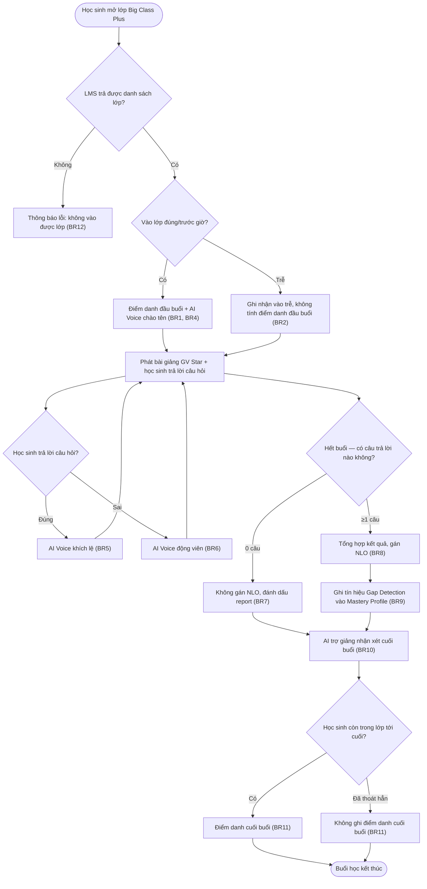

# AICNew-01 Big Class Plus

> ⚠️ **Trạng thái: Bản dựng cho Prototype/Khảo sát tháng 9/2026.** Nội dung PRD này phục vụ việc dựng prototype/demo cho khảo sát phụ huynh T9/2026 (xem [`ke-hoach-thang-9-2026.md`](../../../ke-hoach-thang-9-2026.md)). **CHƯA phải bản đã được xác nhận đầy đủ thông tin chính thức để bàn giao cho đội Dev triển khai sản xuất.** Trước khi handoff dev chính thức, cần: (1) BOD/Product chốt lại hướng sau kết quả khảo sát, (2) rà soát lại Business Rule/Logic với đội kỹ thuật thực tế — đặc biệt cơ chế AI Voice/ghép giọng, độ trễ, và giới hạn thật của LMS.

---

## Metadata

| Field         | Value                                    |
|---------------|--------------------------------------------|
| **PRD ID**    | AICNew-01                                |
| **Version**   | 1.1                                       |
| **Status**    | draft                                     |
| **Author**    | AI-assisted                               |
| **PO**        | Đặng Ngọc Lân                             |
| **Domain**    | ai-class-core                             |
| **Created**   | 2026-09-05                                |
| **Updated**   | 2026-09-05                                |
| **Ticket**    | AICNew-01                                 |
| **API Source** |                                           |

---

# Feature

**Big Class Plus**

Big Class Plus nâng cấp buổi học nhóm hiện tại của Edupia AI Class Plus (Concept 1.2): mỗi buổi vừa phát nội dung bài giảng theo chương trình (bám SGK Global Success), vừa tăng cảm giác tương tác cá nhân qua AI Voice (chào tên, khích lệ/động viên), vừa gán đơn vị kiến thức (NLO) cho từng học sinh dựa trên dữ liệu buổi học để làm điểm khởi đầu cho vòng lặp cá nhân hoá (Adaptive Learning) ở các thành phần phía sau.

*(Xem `00_context/glossary.md`, mục "Edupia Class" — quan hệ tên gọi giữa "Big Class Plus" (thành phần buổi học, PRD này) và "Edupia AI Class Plus" (sản phẩm mẹ, Concept 1.2) đã được xác nhận từ trước, không phải hai sản phẩm trùng tên.)*

---

# 1. Tổng quan

## a. User Story

- **Là một (As a)** phụ huynh có con học Edupia AI Class Plus
- **Tôi muốn (I want to)** con được học buổi học tương tác cá nhân hơn so với buổi Big Class hiện tại (được gọi tên, khích lệ/động viên bằng AI Voice — điều Big Class hiện tại chưa có) và tự động phát hiện lỗ hổng kiến thức ngay trong buổi học
- **Để (So that)** con nhận được lộ trình cá nhân hoá đúng chỗ hổng ngay sau đó, thay vì học đại trà và đợi tới kỳ thi mới biết con yếu ở đâu

## b. Phạm vi

**In Scope**
- Buổi học trực tuyến nhóm, phát nội dung bài giảng (GV Star — video quay sẵn), 2 buổi/tuần, bám sát chương trình SGK Global Success
- AI Voice tăng cảm giác tương tác cá nhân: chào tên đầu buổi, khích lệ khi trả lời đúng, động viên khi trả lời sai
- Gán NLO cho từng học sinh dựa trên dữ liệu câu hỏi tương tác trong buổi học
- Sinh tín hiệu Gap Detection từ dữ liệu gán NLO, ghi vào Mastery Profile của học sinh
- Điểm danh đầu buổi và cuối buổi (kèm ảnh chụp học sinh)
- AI trợ giảng nhận xét kết quả học tập cụ thể cuối buổi + nhắc BTVN Adaptive tương ứng

**Out of Scope**
- Xây dựng cơ chế Adaptive Learning / Routing Engine (thuật toán chọn NLO ưu tiên) — thuộc nền tảng chung, PRD riêng. *("Routing Engine" là tên làm việc hiện dùng trong tài liệu concept — chưa xác nhận là tên chính thức; việc chốt tên và định nghĩa đầy đủ hoãn sang PRD của thành phần Adaptive Learning.)*
- BTVN Adaptive & AI Practice, AI Tutor 30 phút, AI Speak, Edupia Club, GVCN & Parent Mode — mỗi thành phần một PRD riêng; bao gồm cả việc gửi thông báo tới điện thoại phụ huynh (thuộc Parent Mode) — Big Class Plus chỉ ghi nhận dữ liệu (điểm danh, report buổi học — định nghĩa ở §1d). *("BTVN Adaptive" ở đây là tên gọi rút gọn của thành phần "BTVN Adaptive & AI Practice" nêu trên — PRD đó sẽ định nghĩa đầy đủ nội dung bài tập; PRD này chỉ nhắc tên khi AI trợ giảng nhắc bài.)*
- Nội dung 1.473 NLO (NLO Taxonomy) — đã có sẵn
- Cấu trúc chi tiết và cách lưu trữ Mastery Profile xuyên suốt các thành phần — thuộc nền tảng chung
- "AI trợ giảng" (vai trò nhận xét cuối buổi Big Class Plus, xem §3 Actor) là một tên gọi/vai trò **khác** với "AI Tutor 30 phút" (thành phần 30 phút riêng nêu trên) — hai vai trò tách biệt, không nhầm lẫn dù tên gần giống nhau

## c. Phụ thuộc liên service *(mức nghiệp vụ)*

- Cần **Mastery Profile / Adaptive Learning** (nền tảng chung) đã tồn tại để ghi tín hiệu NLO vào và để engine Adaptive Learning đọc tín hiệu đó — vì Big Class Plus không tự vá lỗ hổng, chỉ sinh tín hiệu đầu vào
- Cần **NLO Taxonomy** (1.473 đơn vị) đã có sẵn để hệ thống gán đúng NLO cho học sinh
- Cần **LMS** cung cấp danh sách học sinh thuộc lớp học — để hệ thống biết đang gán NLO cho đúng học sinh nào trong buổi học đó
- Cần **dịch vụ AI Voice** (ghép giọng GV Star) và **hệ thống phát video bài giảng GV Star** đã sẵn sàng — đây là năng lực kỹ thuật lõi mà chính tính năng này dùng để tạo tương tác thời gian thực và phát nội dung; banner đầu tài liệu đã ghi nhận đây là phần cần rà soát cùng đội kỹ thuật trước khi bàn giao dev chính thức

## d. Quy ước

> Khai báo một lần các định nghĩa/ngưỡng dùng chung cho nhiều Business Rule ở §3, tránh lặp lại trong từng ô.

- **Report buổi học** (nhắc tới ở BR2, BR7, BR13, BR14, Screen 3): là bản ghi ở mức nghiệp vụ cho một học sinh trong một buổi học, gồm — trạng thái điểm danh đầu/cuối buổi, cờ "vào trễ" (nếu có), danh sách NLO đã gán (nếu có), cờ "không đủ dữ liệu gán NLO" (nếu có), cờ "Mastery Profile chưa khởi tạo" (nếu có), cờ "thiếu ảnh điểm danh" (nếu có). Đây là input để Parent Mode hiển thị/thông báo cho phụ huynh (Parent Mode ngoài phạm vi PRD này).
- **Mốc "kết thúc buổi học"** (dùng ở BR11, User Flow): được xác định là khi video bài giảng GV Star của buổi đó phát hết (không phải theo đồng hồ thực nếu học sinh tạm dừng/xem lại một đoạn).
- ⛔ **Cần xác nhận kỹ thuật trước khi bàn giao dev** — ngưỡng độ trễ phản hồi của AI Voice (áp dụng cho BR4, BR5, BR6: chào tên đầu buổi, khích lệ khi đúng, động viên khi sai): tài liệu này tạm giả định "vài giây" cho mục đích demo/prototype; giá trị chính xác phụ thuộc khả năng ghép giọng AI Voice thời gian thực, đội kỹ thuật cần xác nhận trước khi PRD được duyệt chính thức.
- ⛔ **Cần xác nhận kỹ thuật/vận hành** — ngưỡng phân biệt "rời kết nối tạm thời" (BR3, vẫn tính điểm danh) và "thoát hẳn" (BR11, không tính điểm danh cuối buổi): đề xuất tạm — học sinh không quay lại lớp trong vòng *(TBD số phút)* hoặc không quay lại trước khi video bài giảng kết thúc thì tính là thoát hẳn. Giá trị số phút cụ thể cần đội vận hành/kỹ thuật xác nhận.

---

# 2. Acceptance Criteria

**AC1:** Học sinh vào lớp trước/đúng giờ bắt đầu buổi → hệ thống ghi điểm danh đầu buổi = Có, lưu ảnh chụp học sinh. _(BR: AICNew-01-UC1-BR1)_

**AC2:** Học sinh vào lớp sau giờ bắt đầu → vẫn được vào học, vẫn được gán NLO, không tính điểm danh đầu buổi, hệ thống ghi nhận "vào trễ". _(BR: AICNew-01-UC1-BR2)_

**AC3:** Học sinh thoát khỏi lớp giữa buổi rồi quay lại trong cùng buổi → điểm danh đầu và cuối buổi vẫn tính đầy đủ như không rời lớp. _(BR: AICNew-01-UC1-BR3)_

**AC4:** Học sinh vào lớp (đúng giờ hoặc trễ) → hệ thống phát đúng đoạn chào tên học sinh đó bằng giọng GV Star. _(BR: AICNew-01-UC1-BR4)_

**AC5:** Học sinh trả lời đúng một câu hỏi → AI Voice gọi tên và khích lệ. _(BR: AICNew-01-UC1-BR5)_

**AC6:** Học sinh trả lời sai một câu hỏi → AI Voice động viên. _(BR: AICNew-01-UC1-BR6)_

**AC7:** Học sinh không trả lời câu nào cả buổi → không có NLO nào được gán, report buổi học đánh dấu "không đủ dữ liệu gán NLO". _(BR: AICNew-01-UC1-BR7)_

**AC8:** Buổi học kết thúc, học sinh có ≥1 câu trả lời → hệ thống gán đúng NLO theo đúng/sai của các câu đã trả lời. _(BR: AICNew-01-UC1-BR8)_

**AC9:** Sau khi gán NLO → hệ thống cộng dồn các NLO "chưa đạt" vào Mastery Profile hiện có, không ghi đè lịch sử. _(BR: AICNew-01-UC1-BR9)_

**AC10:** Cuối buổi học → AI trợ giảng đưa nhận xét đúng theo kết quả học tập của từng học sinh + gợi ý BTVN Adaptive tương ứng. _(BR: AICNew-01-UC1-BR10)_

**AC11:** Học sinh còn trong lớp tới lúc kết thúc → điểm danh cuối buổi = Có kèm ảnh chụp; học sinh đã thoát hẳn trước đó → không ghi điểm danh cuối buổi. _(BR: AICNew-01-UC1-BR11)_

**AC12:** LMS không trả được danh sách lớp/học sinh → học sinh không vào được lớp, nhận thông báo lỗi. _(BR: AICNew-01-UC1-BR12)_

**AC13:** Học sinh chưa có Mastery Profile → vẫn được vào học bình thường, nhưng không có tín hiệu Gap Detection nào được ghi cho tới khi Mastery Profile được khởi tạo; report buổi học đánh dấu "Mastery Profile chưa khởi tạo". _(BR: AICNew-01-UC1-BR13)_

**AC14:** Không lấy được ảnh chụp học sinh lúc điểm danh (đầu hoặc cuối buổi) → điểm danh vẫn được tính, report buổi học đánh dấu "thiếu ảnh điểm danh". _(BR: AICNew-01-UC1-BR14)_

---

# 3. Use Case

#### AICNew-01-UC1: Học sinh tham gia buổi học Big Class Plus

**Actor:** Học sinh, AI Voice (giọng GV Star), AI trợ giảng

**Description:** Học sinh tham gia một buổi học trực tuyến nhóm (bài giảng GV Star — video quay sẵn); hệ thống điểm danh đầu/cuối buổi, AI Voice tăng tương tác cá nhân theo thời gian thực, và cuối buổi hệ thống gán NLO + ghi tín hiệu Gap Detection + AI trợ giảng nhận xét kết quả học tập.

**Pre-condition:**
- Học sinh đã đăng ký lớp Big Class Plus, có lịch học 2 buổi/tuần
- LMS có dữ liệu danh sách học sinh của lớp học đó
- *(Mastery Profile của học sinh thường đã tồn tại từ nền tảng chung — trường hợp chưa tồn tại vẫn được xử lý trong luồng, xem BR13, không phải điều kiện chặn.)*

**Post-condition:**
- Hệ thống đã ghi nhận điểm danh đầu/cuối buổi (trừ ngoại lệ ở BR2/BR11; vẫn ghi nhận kèm cờ thiếu ảnh nếu rơi vào BR14)
- Hệ thống đã gán NLO cho học sinh có trả lời câu hỏi trong buổi (trừ ngoại lệ ở BR7, hoặc tạm hoãn nếu rơi vào BR13)
- Hệ thống đã ghi tín hiệu Gap Detection vào Mastery Profile của học sinh (nếu Mastery Profile đã tồn tại)
- AI trợ giảng đã đưa nhận xét cuối buổi, trước khi điểm danh cuối buổi được ghi nhận

**AC liên quan:** AC1, AC2, AC3, AC4, AC5, AC6, AC7, AC8, AC9, AC10, AC11, AC12, AC13, AC14

**Business Rule**

| ID | Business Rule | Business Logic |
|----|---------------|----------------|
| AICNew-01-UC1-BR1 | Hệ thống PHẢI ghi nhận điểm danh đầu buổi (kèm ảnh chụp học sinh) khi học sinh vào lớp đúng giờ | - Thời điểm học sinh vào lớp ≤ giờ bắt đầu buổi → ghi điểm danh đầu buổi = Có, lưu ảnh chụp học sinh |
| AICNew-01-UC1-BR2 | Khi học sinh vào lớp trễ, hệ thống PHẢI vẫn cho vào học và gán NLO bình thường, nhưng KHÔNG tính điểm danh đầu buổi; PHẢI ghi nhận việc vào trễ | - Thời điểm vào lớp > giờ bắt đầu buổi → điểm danh đầu buổi = Không; đánh dấu "vào trễ" kèm thời điểm vào; học sinh vẫn được vào học bình thường - Ghi "vào trễ" vào report buổi học (để Parent Mode xử lý thông báo phụ huynh sau) |
| AICNew-01-UC1-BR3 | Khi học sinh thoát khỏi lớp giữa buổi rồi quay lại, hệ thống PHẢI vẫn tính điểm danh đầu và cuối buổi đầy đủ như bình thường | - Trạng thái điểm danh (đầu/cuối buổi) đã ghi KHÔNG bị huỷ/reset khi hệ thống phát hiện học sinh rời kết nối tạm thời rồi quay lại trong cùng buổi |
| AICNew-01-UC1-BR4 | Khi học sinh vào lớp (đúng giờ hoặc trễ), AI Voice (giọng GV Star) PHẢI gọi tên chào mừng học sinh đó | - Khi điểm danh đầu buổi = Có (BR1) hoặc khi học sinh vào trễ được ghi nhận (BR2) → ghép tên học sinh vào đoạn âm thanh chào mừng (giọng GV Star), phát khi học sinh vào lớp (ngưỡng độ trễ: xem §1d) |
| AICNew-01-UC1-BR5 | Khi học sinh trả lời đúng câu hỏi, AI Voice PHẢI gọi tên và khích lệ học sinh đó | - Mỗi lần học sinh chọn đáp án đúng → kích hoạt đoạn AI Voice: gọi tên + khích lệ (ngưỡng độ trễ: xem §1d) - Nếu nhiều học sinh trả lời gần như đồng thời → hệ thống PHẢI đảm bảo mọi học sinh đều nhận được phản hồi tương ứng, có thể phát nối tiếp nhau thay vì bỏ sót |
| AICNew-01-UC1-BR6 | Khi học sinh trả lời sai câu hỏi, AI Voice PHẢI động viên học sinh đó | - Mỗi lần học sinh chọn đáp án sai → kích hoạt đoạn AI Voice: động viên (ngưỡng độ trễ: xem §1d) - Nếu nhiều học sinh trả lời gần như đồng thời → áp cùng nguyên tắc đảm bảo phản hồi như BR5 |
| AICNew-01-UC1-BR7 | Khi học sinh không trả lời câu hỏi nào cả buổi, hệ thống KHÔNG ĐƯỢC gán NLO cho học sinh đó; PHẢI đánh dấu vào report buổi học | - Đếm số câu học sinh đã trả lời trong buổi; = 0 → không gán NLO cho học sinh đó - Đánh dấu "không đủ dữ liệu gán NLO" vào report buổi học của học sinh (định nghĩa report buổi học: xem §1d) |
| AICNew-01-UC1-BR8 | Cuối buổi học, hệ thống PHẢI tổng hợp kết quả câu hỏi và gán NLO cho từng học sinh có trả lời | - Với học sinh có ≥1 câu trả lời: tổng hợp danh sách câu đúng/sai → đối chiếu mỗi câu về đúng NLO tương ứng → gán kết quả NLO (đạt/chưa đạt) cho học sinh - Một câu liên quan nhiều NLO → mọi NLO liên quan đều được cập nhật theo kết quả câu đó - Một NLO được kiểm qua nhiều câu trong buổi → NLO đó tính "chưa đạt" nếu có ít nhất một câu sai liên quan (ngưỡng thận trọng, ưu tiên không bỏ sót lỗ hổng — xem Note) |
| AICNew-01-UC1-BR9 | Sau khi gán NLO cuối buổi, hệ thống PHẢI ghi tín hiệu Gap Detection vào Mastery Profile của học sinh | - Với các NLO được gán "chưa đạt" ở BR8 → ghi thành tín hiệu Gap Detection, cộng dồn vào Mastery Profile hiện có của học sinh (không ghi đè lịch sử) - NLO được gán "đạt" KHÔNG được ghi ở tính năng này — có chủ đích: Big Class Plus chỉ theo dõi lỗ hổng, việc theo dõi điểm đã nắm vững thuộc thiết kế Mastery Profile ở nền tảng chung (ngoài phạm vi PRD này) |
| AICNew-01-UC1-BR10 | Cuối buổi học, AI trợ giảng PHẢI nhận xét kết quả học tập cụ thể của từng học sinh và nhắc làm BTVN Adaptive tương ứng, trước khi hệ thống ghi nhận điểm danh cuối buổi (BR11) | - Học sinh có kết quả NLO "chưa đạt" (theo BR8) → AI trợ giảng nhận xét cá nhân hoá (số câu đúng/sai, NLO còn yếu) + gợi ý BTVN Adaptive đúng NLO đó - Học sinh trả lời đúng hết, không có NLO nào "chưa đạt" → AI trợ giảng khen ngợi + gợi ý BTVN Adaptive nâng cao (không gợi ý theo lỗ hổng) - Học sinh không có dữ liệu trả lời (rơi vào BR7) → AI trợ giảng nhắc nhở tham gia tích cực hơn ở buổi sau, không nhận xét theo NLO |
| AICNew-01-UC1-BR11 | Cuối buổi học, hệ thống PHẢI ghi nhận điểm danh cuối buổi (kèm ảnh chụp học sinh) | - Tại mốc "kết thúc buổi học" (định nghĩa: xem §1d), nếu học sinh vẫn còn trong lớp → ghi điểm danh cuối buổi = Có, lưu ảnh chụp học sinh - Học sinh đã thoát hẳn trước khi kết thúc (ngưỡng phân biệt với BR3: xem §1d) → không ghi điểm danh cuối buổi (không tính) |
| AICNew-01-UC1-BR12 | Khi LMS không trả được danh sách học sinh của lớp, hệ thống KHÔNG ĐƯỢC cho học sinh vào lớp | - Gọi LMS lấy danh sách lớp thất bại (lỗi/quá thời gian chờ) → chặn học sinh vào lớp - Hiển thị thông báo lỗi cho học sinh (nội dung cụ thể thuộc UI/UX Guidelines §4) |
| AICNew-01-UC1-BR13 | Khi học sinh chưa có Mastery Profile tồn tại, hệ thống PHẢI vẫn cho học sinh tham gia học bình thường nhưng KHÔNG ghi được tín hiệu Gap Detection; PHẢI đánh dấu vào report buổi học | - Mastery Profile không tồn tại cho học sinh → bỏ qua bước ghi tín hiệu Gap Detection (BR9) cho học sinh đó, đánh dấu "Mastery Profile chưa khởi tạo" vào report buổi học để vận hành xử lý |
| AICNew-01-UC1-BR14 | Khi không lấy được ảnh chụp học sinh lúc điểm danh, hệ thống PHẢI vẫn tính điểm danh nhưng đánh dấu thiếu ảnh | - Không lấy được ảnh chụp tại thời điểm điểm danh (đầu hoặc cuối buổi) → điểm danh vẫn = Có, đánh dấu cờ "thiếu ảnh điểm danh" vào report buổi học |

> **Note BR1-BR3, BR11, BR14:** Cơ chế điểm danh (kèm ảnh chụp) dựa theo mô tả trong `00_context/meeting-notes/2026-08-28-review-slide-concept-sale.md` — hệ thống tự động chụp ảnh học sinh lúc đầu và cuối buổi để báo cáo trạng thái/biểu cảm cho phụ huynh (việc gửi báo cáo thuộc Parent Mode, ngoài phạm vi PRD này). ⚠️ Yêu cầu chụp/lưu ảnh học sinh (trẻ em) cần chính sách bảo mật dữ liệu riêng (thời hạn lưu, phạm vi truy cập, đồng ý phụ huynh) — chưa được định nghĩa trong PRD này, cần Product/Pháp lý bổ sung trước khi bàn giao dev chính thức (xem "Giả định AI" ở Appendix).
>
> **Note BR4-BR6:** "GV Star" là video bài giảng quay sẵn (không phải giáo viên dạy trực tiếp real-time) — AI Voice dùng giọng thật của giáo viên chính để tạo cảm giác tương tác cá nhân. Xem `00_context/glossary.md` entry "GV Star".
>
> **Note BR8:** Quy tắc ngưỡng đạt/chưa đạt khi một câu liên quan nhiều NLO, hoặc một NLO được kiểm qua nhiều câu, là suy luận của AI theo nguyên tắc ưu tiên không bỏ sót lỗ hổng — cần PO xác nhận trước khi dev triển khai (xem "Giả định AI" ở Appendix).
>
> **Note BR13:** Cách xử lý khi Mastery Profile chưa tồn tại (vẫn cho học bình thường, không chặn như BR12) là suy luận của AI, khác hẳn cách xử lý chặn hẳn khi LMS lỗi (BR12) vì đây là vấn đề của một học sinh, không phải toàn lớp — cần PO xác nhận (xem "Giả định AI" ở Appendix).

---

# 4. UI/UX Guidelines

## a. User Flow

## b. Wireframe

> *(AI đề xuất — PO xác nhận "tạm thời chính xác, sẽ bổ sung sau" ở buổi khám phá — xem "Giả định AI" ở Appendix.)*

### Screen 1: Màn hình lớp học live

| Thành phần | Chi tiết |
|------------|----------|
| **Screen** | Học sinh xem bài giảng GV Star, hệ thống điểm danh khi vào/ra lớp |
| **Components** | - Video bài giảng (GV Star) - Danh sách học sinh trong lớp |
| **Actions** | - Học sinh vào lớp → hệ thống điểm danh đầu buổi, AI Voice chào tên (BR1, BR4) - Học sinh vào trễ → vẫn học được, ghi nhận vào trễ (BR2) |

---

### Screen 2: Màn hình câu hỏi tương tác

| Thành phần | Chi tiết |
|------------|----------|
| **Screen** | Học sinh trả lời câu hỏi trắc nghiệm trong lúc học |
| **Components** | - Câu hỏi - Các đáp án để chọn |
| **Actions** | - Chọn đáp án đúng → AI Voice khích lệ (BR5) - Chọn đáp án sai → AI Voice động viên (BR6) |

---

### Screen 3: Màn hình tổng kết buổi học

| Thành phần | Chi tiết |
|------------|----------|
| **Screen** | Hiển thị trước khi điểm danh cuối buổi |
| **Components** | - Kết quả tổng hợp của học sinh trong buổi - Nhận xét của AI trợ giảng |
| **Actions** | - Hiển thị kết quả NLO vừa gán (BR8) - AI trợ giảng nhận xét + nhắc BTVN Adaptive (BR10) - Học sinh thuộc trường hợp BR7 (không trả lời câu nào): hiển thị nhắc nhở tham gia tích cực hơn, không hiển thị bảng kết quả NLO |

---

# Appendix

## Input gốc từ PO

> Nguồn: [`00_context/AICNew-01-big-class-plus.md`](../../../../00_context/AICNew-01-big-class-plus.md) (Product Definition, Phase 1-7 hoàn tất 2026-09-05). Discovery xác định lại bản chất "GV Star" là video quay sẵn (không phải giáo viên dạy live) dựa trên bằng chứng trong meeting note 2026-08-28, khác với cách mô tả trong slide concept ban đầu.

## Tài liệu tham khảo

- Product Definition: [`00_context/AICNew-01-big-class-plus.md`](../../../../00_context/AICNew-01-big-class-plus.md)
- Slide content Concept 1.2: [`03_product/concepts/slide-content-concept-1.2-product-dev-2026-09-04-final.md`](../../../../03_product/concepts/slide-content-concept-1.2-product-dev-2026-09-04-final.md)
- Meeting note (nguồn cơ chế AI Voice/điểm danh): [`00_context/meeting-notes/2026-08-28-review-slide-concept-sale.md`](../../../../00_context/meeting-notes/2026-08-28-review-slide-concept-sale.md)
- Kế hoạch tháng 9: [`04_delivery/ke-hoach-thang-9-2026.md`](../../../ke-hoach-thang-9-2026.md)
- BDD: [`./bdd/`](./bdd/)
- Design spec: [`./design-spec/`](./design-spec/)
- Từ điển nghiệp vụ: [`00_context/glossary.md`](../../../../00_context/glossary.md)

## Giả định AI

- **Q1 — [AI DRAFT] Wireframe (§4b) chưa đầy đủ:** PO xác nhận màn hình & thành phần chính ở buổi khám phá là "tạm thời chính xác, sẽ bổ sung sau" — chưa có mô tả chi tiết cho việc điểm danh có màn hình riêng hay làm trực tiếp trên màn hình lớp học. **Cần PO chốt chi tiết trước khi Designer bắt đầu Design Spec chính thức.**
- **Q2 — [AI DRAFT] Ngưỡng độ trễ AI Voice (§1d, BR4/BR5/BR6) và ngưỡng "thoát hẳn" (§1d, BR3/BR11) chưa có giá trị cụ thể:** đây là các thông số kỹ thuật/vận hành mà AI không có căn cứ để tự đặt số — tài liệu chỉ tạm dùng mô tả định tính ("vài giây", "TBD số phút") cho mục đích prototype/demo. **Cần đội kỹ thuật/vận hành xác nhận giá trị cụ thể trước khi PRD được duyệt chính thức.**
- **Q3 — [AI DRAFT] Ngưỡng đạt/chưa đạt của một NLO khi liên quan nhiều câu hỏi (BR8):** AI đề xuất quy tắc "một câu sai là đủ để tính NLO đó chưa đạt" theo nguyên tắc thận trọng (ưu tiên không bỏ sót lỗ hổng) — đây là suy luận, chưa phải quyết định nghiệp vụ đã được PO xác nhận trực tiếp. **Cần PO xác nhận quy tắc này có đúng ý đồ sản phẩm không.**
- **Q4 — [AI DRAFT] Cách xử lý khi Mastery Profile chưa tồn tại (BR13):** AI đề xuất vẫn cho học sinh học bình thường, chỉ tạm hoãn ghi Gap Detection — khác với cách chặn hẳn khi LMS lỗi (BR12). Đây là suy luận dựa trên việc đây là vấn đề của một học sinh (không nên ảnh hưởng cả lớp), chưa phải quyết định đã được PO xác nhận trực tiếp. **Cần PO xác nhận hướng xử lý này.**
- **Q5 — [AI DRAFT] Chính sách bảo mật ảnh chụp học sinh (Note BR1-BR3/BR11/BR14):** PRD yêu cầu chụp/lưu ảnh học sinh (trẻ em) nhưng chưa có chính sách lưu trữ/thời hạn/quyền truy cập/đồng ý phụ huynh — ngoài phạm vi hiểu biết của AI về chính sách nội bộ Edupia. **Cần Product/Pháp lý bổ sung chính sách trước khi bàn giao dev chính thức.**

---

# Change Log

> Hiện tại: **v1.1** (2026-09-05)

| Version | Date | Changes (UC/AC/BR bị ảnh hưởng) |
|---------|------|---------------------------------|
| 1.1 | 2026-09-05 | Áp dụng 31 finding từ `/review-context --resume` (F001-F031): UC1: sửa thuật ngữ kỹ thuật (BR8, §1b); di dời ràng buộc trình tự AC10→BR10; thêm BR13 (Mastery Profile chưa tồn tại), BR14 (thiếu ảnh điểm danh) + AC13, AC14; mở rộng BR4 sang cả học sinh vào trễ; làm rõ BR9 (chỉ ghi NLO chưa đạt), BR10 (3 nhánh nhận xét); PRD-global: thêm §1d Quy ước (định nghĩa report buổi học, mốc kết thúc buổi, ngưỡng AI Voice/thoát hẳn — một số còn ⛔ cần xác nhận kỹ thuật/PO, xem Giả định AI Q2-Q5); viết lại câu bị động ở Post-condition/AC8/AC9; làm rõ quan hệ tên gọi Big Class Plus/Edupia AI Class Plus, AI trợ giảng/AI Tutor, BTVN Adaptive. |
| 1.0 | 2026-09-05 | Bản đầu — sinh từ product-definition. Phục vụ dựng prototype/demo cho khảo sát phụ huynh T9/2026 — **chưa chốt chính thức để bàn giao dev** (xem banner đầu tài liệu). |

---
