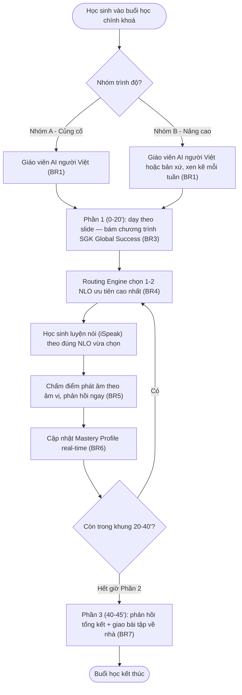

# AICNew-03 AI Tutor 1-1 · Buổi học chính khoá (45 phút)

> ⚠️ **Trạng thái: Bản dựng cho Prototype/Khảo sát.** PRD này phục vụ việc dựng prototype/demo cho Concept 3.1 (Edupia AI Tutor 1-1), theo cùng mục đích với [AICNew-01](../../ai-class-core/big-class-plus/AICNew-01-big-class-plus.md) (Big Class Plus) trong khảo sát phụ huynh T9/2026. **CHƯA phải bản đã được xác nhận đầy đủ thông tin chính thức để bàn giao cho đội Dev triển khai sản xuất.** Khác với AICNew-01, PRD này được sinh **trực tiếp từ tài liệu concept** (chưa qua phiên khám phá trực tiếp với PO — xem [Product Definition](../../../../00_context/AICNew-03-ai-tutor-1-1-buoi-hoc.md)). ✅ **PO đã chốt dứt điểm 2026-09-15** (sau khi sửa lại một lần vì câu trả lời 09-10 hoá ra ngược với 3 nguồn khác — xem Giả định AI Q1): ánh xạ nhóm trình độ → Giáo viên AI, đổi tên hẳn thành **"Nhóm A - Củng cố"** (yếu/trung bình) / **"Nhóm B - Nâng cao"** (khá/giỏi), không dùng "Level A/B" nữa. Cũng đã chốt: giao diện 2 camera (Q1b), gamification có trong scope (Q3), buổi chuyên sâu tham khảo mô hình AICNew-02 (Q6), Mastery Model `decay` sẽ mock cho MVP/demo (Q2). Trước khi handoff dev chính thức, vẫn cần: (1) **kết luận brainstorm Phần 1 dùng video quay sẵn hay live thật** (ảnh hưởng chi phí/tính khả thi — xem Giả định AI Q7, điểm mở quan trọng nhất còn lại), (2) PO trả lời 6 edge case chưa có nguồn (Giả định AI Q5), (3) giá trị thật cho Mastery Model trước khi lên production (Giả định AI Q2), (4) cơ chế cụ thể của gamification (Giả định AI Q3), (5) PO/Designer xác nhận Wireframe suy diễn (Giả định AI Q4).

---

## Metadata

| Field         | Value                                    |
|---------------|--------------------------------------------|
| **PRD ID**    | AICNew-03                                |
| **Version**   | 1.2                                       |
| **Status**    | draft                                     |
| **Author**    | AI-assisted                               |
| **PO**        | Đặng Ngọc Lân                             |
| **Domain**    | ai-tutor                                  |
| **Created**   | 2026-09-10                                |
| **Updated**   | 2026-09-10                                |
| **Ticket**    | AICNew-03                                 |
| **API Source** |                                           |

---

# Feature

**AI Tutor 1-1 — Buổi học chính khoá (45 phút)**

Buổi học chính khoá 1-kèm-1 thật sự (không phải học nhóm) của Edupia AI Tutor 1-1 (Concept 3.1): 45 phút/buổi, 2 buổi/tuần, chia 3 phần — dạy nội dung bám khung chương trình (SGK Global Success), luyện nói cá nhân hoá 100% theo đúng lỗ hổng kiến thức (NLO) của từng học sinh qua Routing Engine, chấm phát âm theo âm vị, và cập nhật Mastery Profile theo thời gian thực.

*(Xem `00_context/glossary.md`, mục "AI Tutor" — phân biệt rõ với "AI Bổ trợ 30 phút" ([AICNew-02](../../ai-class-core/ai-bo-tro-30-phut/AICNew-02-ai-bo-tro-30-phut.md), thuộc Concept 1.2) và với "Edupia Tutor 1-1" (họ sản phẩm gia sư người thật, khác phân khúc) — ba tên gần giống nhau nhưng là ba sản phẩm/tính năng khác nhau.)*

---

# 1. Tổng quan

## a. User Story

- **Là một (As a)** phụ huynh có con học Edupia AI Tutor 1-1
- **Tôi muốn (I want to)** con được học 1-kèm-1 thật sự với giáo viên AI phù hợp trình độ, mỗi buổi đều luyện đúng chỗ con đang yếu thay vì lặp lại cái con đã biết
- **Để (So that)** con vá đúng lỗ hổng kiến thức của riêng mình, với chi phí chỉ bằng một phần nhỏ gia sư người thật

## b. Phạm vi

**In Scope**
- Buổi học chính khoá 1-1, 45 phút, 2 buổi/tuần, bám khung chương trình SGK Global Success
- Phần 1 (20'): dạy nội dung theo slide (video hoạt hình từ vựng + video hội thoại ngữ pháp) bởi Giáo viên AI — ⚠️ **đang brainstorm lại** có nên giữ video quay sẵn hay chuyển sang tương tác live thật (ảnh hưởng chi phí/tính khả thi kỹ thuật), xem Giả định AI Q7
- Phần 2 (20'): hỏi đáp & sửa lỗi qua iSpeak — Routing Engine chọn câu hỏi luyện nói theo đúng NLO học sinh đang yếu nhất; chấm điểm phát âm theo âm vị, phản hồi ngay trong buổi
- Phần 3 (5'): phản hồi tổng kết + giao bài tập về nhà (ngay sau buổi)
- Cập nhật Mastery Profile của học sinh theo Mastery Model, thời gian thực sau mỗi tương tác ở Phần 2 — bản MVP/demo giả lập giá trị này (xem Giả định AI Q2)
- Ghép đúng Giáo viên AI theo Nhóm A - Củng cố / Nhóm B - Nâng cao của học sinh cho mỗi buổi
- Giao diện buổi học có **2 camera** (Giáo viên AI + học sinh), kiểu học 1-1 thật
- Gamification trong buổi học (huy hiệu, thử thách, có thể gồm mini-game) — đã xác nhận thuộc phạm vi, nhưng cơ chế/luật chơi cụ thể chưa được định nghĩa (xem Giả định AI Q3)

**Out of Scope**
- **Buổi chuyên sâu** (buổi thứ 5, sau mỗi 4 buổi chính khoá) — tài liệu nguồn chưa mô tả cấu trúc nội dung chi tiết. *("4+1" là nhịp học đã xác nhận ở Concept 3.1; PO định hướng tham khảo mô hình rẽ nhánh Nâng cao/Củng cố của [AICNew-02](../../ai-class-core/ai-bo-tro-30-phut/AICNew-02-ai-bo-tro-30-phut.md) khi làm PRD riêng cho buổi chuyên sâu, xem Giả định AI Q6.)*
- **Cơ chế chi tiết của Gamification** (luật chơi cụ thể từng mini-game, cách tính điểm) — hướng có gamification đã được xác nhận (xem In Scope), nhưng cần bổ sung riêng trước khi viết Business Rule đầy đủ.
- **Xây dựng cơ chế Routing Engine / Mastery Model** (thuật toán chọn NLO ưu tiên, giá trị decay...) — thuộc nền tảng chung Adaptive Learning Ecosystem, PRD riêng. Feature này chỉ **tiêu thụ** kết quả Routing Engine và **ghi** tín hiệu theo Mastery Model, không thiết kế lại các cơ chế đó.
- **AI Practice, AI Speak (nhập vai tình huống), Edupia Club, GVCN** — 4 thành phần còn lại của Concept 3.1; mỗi thành phần một PRD riêng.
- **Xác định Nhóm A/B đầu vào ban đầu** (bài kiểm tra phân loại trình độ khi học sinh mới bắt đầu) — feature này chỉ tiêu thụ nhóm đã có sẵn để chọn Giáo viên AI tương ứng.
- Nội dung 1.473 NLO (NLO Taxonomy) — đã có sẵn
- Cấu trúc chi tiết và cách lưu trữ Mastery Profile xuyên suốt các thành phần — thuộc nền tảng chung

## c. Phụ thuộc liên service *(mức nghiệp vụ)*

- Cần **Mastery Profile / Adaptive Learning** (nền tảng chung) đã tồn tại để Routing Engine đọc và để feature này ghi tín hiệu cập nhật vào
- Cần **Routing Engine** (nền tảng chung, hiện ◆ Pending BOD theo `00_context/glossary.md`) trả về đúng 1-2 NLO ưu tiên cho Phần 2 mỗi buổi
- Cần **NLO Taxonomy** (1.473 đơn vị) đã có sẵn
- Cần dữ liệu **Nhóm A/B đầu vào** của học sinh (nguồn xác định nhóm — ngoài phạm vi PRD này) để chọn đúng Giáo viên AI
- Cần dịch vụ **Giáo viên AI** (giọng nói + hình ảnh nhân hoá theo nhóm, gồm giọng bản xứ Anh/Mỹ cho nhánh liên quan) và dịch vụ **chấm phát âm theo âm vị** đã sẵn sàng — năng lực kỹ thuật lõi, cần rà soát cùng đội kỹ thuật trước khi bàn giao dev chính thức

## d. Quy ước

> Khai báo một lần các định nghĩa/ngưỡng dùng chung cho nhiều Business Rule ở §3.

- **Cấu trúc buổi học chính khoá**: 45 phút chia đúng 3 phần theo mốc thời gian — Phần 1: phút 0-20 (dạy theo slide); Phần 2: phút 20-40 (luyện nói iSpeak, cá nhân hoá theo Routing Engine); Phần 3: phút 40-45 (phản hồi tổng kết + giao bài tập). Không áp dụng cho buổi chuyên sâu (ngoài phạm vi PRD này).
- ✅ **PO chốt dứt điểm 2026-09-15** — ánh xạ nhóm trình độ → Giáo viên AI (áp dụng BR1, AC1): **Nhóm A - Củng cố (yếu/trung bình) → giáo viên AI người Việt**; **Nhóm B - Nâng cao (khá/giỏi) → 1 buổi giáo viên AI người Việt (ngữ pháp chuyên sâu) + 1 buổi giáo viên AI bản xứ Anh/Mỹ (luyện giao tiếp)** — khớp Slide 8 + meeting note 28/08 + xác nhận PO 03/09, KHÔNG dùng cách đọc của Slide 15 (câu trả lời tạm 09-10 đã bị supersede — xem Giả định AI Q1). Tên gọi "Nhóm A/B" thay thế hẳn "Level A/B" cũ để tránh nhầm lẫn. Thứ tự cụ thể buổi nào trong tuần dùng giáo viên bản xứ (với Nhóm B) vẫn **chưa có nguồn** — không tự suy diễn thêm.
- ⛔ **Cần xác nhận kỹ thuật** — giá trị `decay` và cách quy đổi điểm chấm âm vị (0-100) thành "tín hiệu mới" trong công thức Mastery Model (áp dụng BR6): tài liệu nguồn chỉ cho dạng công thức tổng quát `mastery_mới = mastery_cũ × decay + tín hiệu mới`, không cho giá trị cụ thể.

---

# 2. Acceptance Criteria

**AC1:** Học sinh Nhóm A - Củng cố vào buổi học → hệ thống ghép giáo viên AI người Việt; học sinh Nhóm B - Nâng cao vào buổi học → hệ thống ghép giáo viên AI người Việt hoặc bản xứ theo đúng lịch xen kẽ 1-1 mỗi tuần. _(BR: AICNew-03-UC1-BR1)_

**AC2:** Buổi học chạy đúng thứ tự và mốc thời gian 3 phần: Phần 1 (0-20') → Phần 2 (20-40') → Phần 3 (40-45'). _(BR: AICNew-03-UC1-BR2)_

**AC3:** Nội dung Phần 1 đúng tiến độ khung chương trình SGK Global Success đã lên cho buổi đó (video hoạt hình từ vựng + video hội thoại ngữ pháp). _(BR: AICNew-03-UC1-BR3)_

**AC4:** Đầu Phần 2 → hệ thống hiển thị câu hỏi luyện nói đúng 1-2 NLO ưu tiên cao nhất mà Routing Engine vừa chọn theo Mastery Profile hiện tại của học sinh. _(BR: AICNew-03-UC1-BR4)_

**AC5:** Học sinh nói câu trả lời ở Phần 2 → hệ thống trả điểm 0-100 cho từng âm và hiển thị ngay trong buổi, không trễ tới cuối buổi. _(BR: AICNew-03-UC1-BR5)_

**AC6:** Ngay sau mỗi lượt chấm ở Phần 2 → Mastery Profile của học sinh được cập nhật theo công thức Mastery Model, không chờ tới cuối buổi mới ghi. _(BR: AICNew-03-UC1-BR6)_

**AC7:** Cuối buổi (Phần 3) → Giáo viên AI đưa phản hồi tổng kết và giao bài tập về nhà đúng NLO vừa luyện ở Phần 2. _(BR: AICNew-03-UC1-BR7)_

---

# 3. Use Case

#### AICNew-03-UC1: Học sinh tham gia buổi học chính khoá AI Tutor 1-1

**Actor:** Học sinh, Giáo viên AI (phân theo Nhóm A - Củng cố / Nhóm B - Nâng cao), Routing Engine (hệ thống nền)

**Description:** Học sinh tham gia một buổi học 1-1 thật sự (45 phút) với Giáo viên AI được ghép theo nhóm trình độ; buổi học chia 3 phần — dạy theo chương trình, luyện nói cá nhân hoá theo NLO đang yếu nhất (qua Routing Engine) kèm chấm phát âm theo âm vị, và phản hồi tổng kết + giao bài tập cuối buổi. Mastery Profile được cập nhật real-time trong suốt Phần 2.

**Pre-condition:**
- Học sinh đã đăng ký AI Tutor 1-1, có lịch học 2 buổi/tuần
- Nhóm A/B đầu vào của học sinh đã được xác định từ trước (nguồn xác định: ngoài phạm vi PRD này)
- Mastery Profile của học sinh đã tồn tại từ nền tảng chung

**Post-condition:**
- Giáo viên AI đã được ghép đúng theo nhóm của học sinh cho buổi học đó
- Buổi học đã chạy đủ 3 phần theo đúng thứ tự và mốc thời gian
- Mastery Profile của học sinh đã được cập nhật real-time theo kết quả luyện nói ở Phần 2
- Bài tập về nhà tương ứng NLO vừa luyện đã được giao ở cuối buổi

**AC liên quan:** AC1, AC2, AC3, AC4, AC5, AC6, AC7

**Business Rule**

| ID | Business Rule | Business Logic |
|----|---------------|----------------|
| AICNew-03-UC1-BR1 | Hệ thống PHẢI ghép đúng Giáo viên AI theo nhóm trình độ đã có sẵn của học sinh: Nhóm A - Củng cố (yếu/trung bình) → giáo viên AI người Việt; Nhóm B - Nâng cao (khá/giỏi) → 1 buổi giáo viên AI người Việt + 1 buổi giáo viên AI bản xứ Anh/Mỹ mỗi tuần | - Đọc nhóm trình độ của học sinh (nguồn ngoài phạm vi PRD này) → nếu Nhóm A - Củng cố: khởi tạo giáo viên AI người Việt cho cả 2 buổi/tuần; nếu Nhóm B - Nâng cao: khởi tạo giáo viên AI người Việt cho 1 buổi và giáo viên AI bản xứ cho 1 buổi còn lại (thứ tự cụ thể buổi nào: xem §1d, chưa có nguồn) |
| AICNew-03-UC1-BR2 | Buổi học PHẢI chạy đúng thứ tự 3 phần: Phần 1 (20') → Phần 2 (20') → Phần 3 (5') | - Đếm mốc thời gian buổi học theo quy ước tại §1d: 0-20' = Phần 1, 20-40' = Phần 2, 40-45' = Phần 3 |
| AICNew-03-UC1-BR3 | Phần 1, Giáo viên AI PHẢI dạy nội dung bám khung chương trình SGK Global Success | - Phát nội dung Phần 1 (video hoạt hình từ vựng + video hội thoại ngữ pháp) theo đúng tiến độ chương trình đã lên — không cá nhân hoá thứ tự bài, giống mọi học sinh cùng tiến độ |
| AICNew-03-UC1-BR4 | Bắt đầu Phần 2, Routing Engine PHẢI chọn 1-2 NLO ưu tiên cao nhất hiện tại của học sinh làm nội dung câu hỏi luyện nói | - Gọi Routing Engine với input = Mastery Profile hiện tại của học sinh → nhận về 1-2 NLO ưu tiên → map NLO sang bộ câu hỏi luyện nói (iSpeak) tương ứng |
| AICNew-03-UC1-BR5 | Khi học sinh trả lời câu hỏi luyện nói (Phần 2), hệ thống PHẢI chấm điểm phát âm theo âm vị và phản hồi ngay trong buổi | - Học sinh nói câu trả lời → mô hình chấm phát âm phân tích theo từng âm vị trong câu → trả điểm thang 0-100 cho mỗi âm → tổng hợp hiển thị cho học sinh ngay |
| AICNew-03-UC1-BR6 | Sau mỗi lượt chấm ở Phần 2, hệ thống PHẢI cập nhật Mastery Profile của học sinh theo Mastery Model ngay lập tức | - Với mỗi âm/NLO vừa chấm: `mastery_mới = mastery_cũ × decay + tín hiệu mới` (giá trị `decay` và cách quy đổi điểm chấm âm vị thành "tín hiệu mới": xem §1d, cần đội kỹ thuật xác nhận) → ghi đè giá trị mastery mới cho đúng NLO đó trong Mastery Profile, không chờ tới cuối buổi |
| AICNew-03-UC1-BR7 | Phần 3, Giáo viên AI PHẢI đưa phản hồi tổng kết buổi và giao bài tập về nhà tương ứng NLO vừa luyện ở Phần 2 | - Tổng hợp danh sách NLO vừa luyện ở Phần 2 (kèm điểm) → Giáo viên AI sinh phản hồi tổng kết + đề xuất bài tập về nhà tương ứng đúng NLO đó |

> **Note BR1:** Tài liệu nguồn (slide Concept 3.1 bản "final") mâu thuẫn giữa Slide 8 và Slide 15 về việc Level A là trình độ cao hay thấp hơn Level B — nghi là phần dư sót lại từ phương án cũ (Level A/B/C/D) chưa dọn hết. **PO đã chốt dứt điểm 2026-09-15: Slide 8 đúng** (khớp thêm meeting note 28/08 và xác nhận PO 03/09) — nhóm yếu/trung bình học giáo viên người Việt, nhóm khá/giỏi học thêm 1 buổi giáo viên bản xứ. Slide 15 và câu trả lời tạm 09-10 (đọc theo Slide 15) đã bị supersede, không dùng (xem Giả định AI Q1). Tên gọi chính thức đổi thành "Nhóm A - Củng cố" / "Nhóm B - Nâng cao" để tránh nhầm với "Level A/B" cũ. Thứ tự cụ thể buổi nào trong tuần dùng giáo viên bản xứ (Nhóm B) vẫn chưa có nguồn.
>
> **Note BR6:** Công thức Mastery Model (`mastery_mới = mastery_cũ × decay + tín hiệu mới`) là công thức duy nhất được cấp trong tài liệu nguồn (Slide 17, "Adaptive Learning Ecosystem — BOD Deck") — nó mô tả *dạng* mô hình, không phải giá trị `decay` cụ thể hay cách quy đổi điểm âm vị 0-100 thành "tín hiệu mới". Đây là chi tiết thuật toán thuộc nền tảng chung Adaptive Learning (ngoài phạm vi PRD này theo §1b), ghi lại ở đây vì BR6 cần tham chiếu tới nó.

---

# 4. UI/UX Guidelines

## a. User Flow

## b. Wireframe

> *(AI đề xuất — CHƯA có Wireframe/Figma thật cho AI Tutor 1-1, xem Giả định AI Q4.)*

### Screen 1: Màn hình buổi học 1-1 — Phần 1 (dạy theo slide)

| Thành phần | Chi tiết |
|------------|----------|
| **Screen** | Học sinh xem Giáo viên AI dạy nội dung theo slide |
| **Components** | - Video bài giảng (Giáo viên AI) - Khung 2 camera (Giáo viên AI + học sinh) |
| **Actions** | - Học sinh vào buổi → hệ thống ghép Giáo viên AI theo Nhóm A/B (BR1) - Hết 20 phút → chuyển Phần 2 (BR2) |

---

### Screen 2: Màn hình buổi học 1-1 — Phần 2 (luyện nói iSpeak)

| Thành phần | Chi tiết |
|------------|----------|
| **Screen** | Học sinh luyện nói theo câu hỏi Routing Engine vừa chọn, xem kết quả chấm phát âm |
| **Components** | - Câu hỏi luyện nói (theo NLO ưu tiên) - Icon mic - Kết quả chấm điểm theo âm vị |
| **Actions** | - Học sinh nói → hệ thống chấm điểm + phản hồi ngay (BR5) - Sau chấm → Mastery Profile cập nhật (BR6), lặp lại câu hỏi tiếp theo tới hết 20 phút |

---

### Screen 3: Màn hình tổng kết buổi học — Phần 3

| Thành phần | Chi tiết |
|------------|----------|
| **Screen** | Hiển thị trước khi kết thúc buổi |
| **Components** | - Phản hồi tổng kết của Giáo viên AI - Bài tập về nhà được giao |
| **Actions** | - Hiển thị phản hồi tổng kết theo kết quả Phần 2 (BR7) - Giao bài tập về nhà đúng NLO vừa luyện (BR7) |

---

# Appendix

## Input gốc từ PO

> Nguồn: [`00_context/AICNew-03-ai-tutor-1-1-buoi-hoc.md`](../../../../00_context/AICNew-03-ai-tutor-1-1-buoi-hoc.md) (Product Definition, tổng hợp từ tài liệu 2026-09-10 — **chưa qua phiên khám phá trực tiếp với PO**, khác với AICNew-01/AICNew-02). Nguồn gốc: `03_product/concepts/slide-content-concept-3.1-product-dev-2026-09-04-final.md` (Slide 8-10, 14-15, 17).

## Tài liệu tham khảo

- Product Definition: [`00_context/AICNew-03-ai-tutor-1-1-buoi-hoc.md`](../../../../00_context/AICNew-03-ai-tutor-1-1-buoi-hoc.md)
- Slide content Concept 3.1: [`03_product/concepts/slide-content-concept-3.1-product-dev-2026-09-04-final.md`](../../../../03_product/concepts/slide-content-concept-3.1-product-dev-2026-09-04-final.md)
- Meeting note (nguồn tham khảo lịch sử — trước bản final, xem Giả định AI Q3): [`00_context/meeting-notes/2026-08-28-review-slide-concept-sale.md`](../../../../00_context/meeting-notes/2026-08-28-review-slide-concept-sale.md)
- Thành phần liên quan cùng nền tảng: [AICNew-01](../../ai-class-core/big-class-plus/AICNew-01-big-class-plus.md) (Big Class Plus, Concept 1.2) — tham khảo cách xử lý Routing Engine/Mastery Profile ở feature tương tự
- BDD: [`./bdd/`](./bdd/)
- Design spec: [`./design-spec/`](./design-spec/)
- Từ điển nghiệp vụ: [`00_context/glossary.md`](../../../../00_context/glossary.md)

## Giả định AI

- **Q1 — ✅ ĐÃ CHỐT DỨT ĐIỂM 2026-09-15 (sửa lại câu trả lời 09-10) — Xung đột ánh xạ Level/Nhóm → Giáo viên AI (§1d, BR1/AC1):** Slide 8 ghi "Level B/C/D học giáo viên AI người Việt; Level A học thêm 1 buổi giáo viên AI bản xứ" (Level A = trình độ cao hơn). Slide 15 ghi ngược lại (Level A = trình độ thấp hơn). Ngày 09-10 PO từng trả lời theo Slide 15 — nhưng khi đối chiếu thêm với meeting note 2026-08-28 (mục đánh dấu "Thống nhất lựa chọn") và một xác nhận trực tiếp khác của PO ngày 2026-09-03 (đã lưu từ trước), cả hai đều khớp Slide 8, ngược với câu trả lời 09-10. **PO xác nhận lại 2026-09-15: Slide 8 đúng** (nhóm yếu/trung bình → giáo viên người Việt; nhóm khá/giỏi → thêm 1 buổi giáo viên bản xứ) — Slide 15 và câu trả lời 09-10 không dùng nữa. **Đồng thời PO quyết định bỏ hẳn tên "Level A/B"** (đã gây nhầm lẫn 2 lần) — tên chính thức từ nay là **"Nhóm A - Củng cố"** (yếu/trung bình) / **"Nhóm B - Nâng cao"** (khá/giỏi) — ✅ **cả hai tên đã được PO xác nhận đúng, kể cả "Nhóm B - Nâng cao" (do AI suy theo mẫu song song, PO xác nhận thêm 2026-09-15)**. ⚠️ Lưu ý: tên mới KHÔNG kế thừa nghĩa chữ theo "Level A/B" cũ — trùng chữ cái "A" là ngẫu nhiên. Còn lại câu hỏi phụ chưa trả lời: thứ tự cụ thể buổi nào trong tuần dùng giáo viên bản xứ cho Nhóm B — chưa có nguồn.
- **Q2 — [AI DRAFT, một phần đã trả lời 2026-09-15] Giá trị `decay` và cách quy đổi điểm âm vị thành tín hiệu Mastery Model (§1d, BR6):** tài liệu nguồn chỉ cho công thức dạng tổng quát, không có giá trị cụ thể. **PO xác nhận 2026-09-15: bản MVP/demo sẽ giả lập (mock) giá trị này, không chặn việc dựng demo.** Vẫn cần đội thuật toán/kỹ thuật cung cấp giá trị thật trước khi bàn giao dev sản xuất.
- **Q3 — [một phần đã trả lời 2026-09-15] Chi tiết UI/gamification từ meeting note 2026-08-28 có còn hiệu lực không:** meeting note mô tả giao diện "Cam học sinh, bảng tương tác thông minh, khung chat" và gamification (Bắn cung, Đào vàng, Chém hoa quả, Đua xe...). **PO xác nhận 2026-09-15:** (a) giao diện có **camera riêng cho Giáo viên AI** — 2 camera đúng như Slide 15, không theo meeting note (chỉ 1 cam học sinh); (b) **gamification vẫn thuộc phạm vi** (đã đưa vào In Scope §1b) — nhưng cơ chế/luật chơi cụ thể của từng mini-game **vẫn chưa được định nghĩa**, cần bổ sung trước khi viết Business Rule đầy đủ.
- **Q4 — [AI DRAFT] Wireframe (§4b) hoàn toàn do AI suy diễn, chưa có Figma/thiết kế thật cho AI Tutor 1-1** (khác với AICNew-01 đã có 2 Figma frame thật). **Cần PO/Designer cung cấp thiết kế thật hoặc xác nhận hướng suy diễn trước khi Designer bắt đầu Design Spec chính thức.**
- **Q5 — [AI DRAFT] 6 edge case chưa có nguồn xử lý** (vào trễ, mất kết nối, mic lỗi ở Phần 2, Nhóm A/B chưa xác định, buổi chuyên sâu có bị lùi lịch khi nghỉ buổi chính khoá, Routing Engine lỗi/timeout) — liệt kê đầy đủ tại Product Definition, Phase 2. **Cần PO trả lời trước khi bổ sung Business Rule tương ứng.**
- **Q6 — [một phần đã trả lời 2026-09-15] Cấu trúc buổi chuyên sâu (buổi thứ 5, sau mỗi 4 buổi chính khoá):** tài liệu nguồn chỉ nhắc tên gọi, chưa mô tả nội dung/cấu trúc. **PO định hướng 2026-09-15: tham khảo mô hình rẽ nhánh Nâng cao/Củng cố đã dùng ở [AICNew-02](../../ai-class-core/ai-bo-tro-30-phut/AICNew-02-ai-bo-tro-30-phut.md)** (AI Bổ trợ 30 phút, Concept 1.2) thay vì thiết kế mới từ đầu. Vẫn cần một PRD riêng đủ chi tiết mới viết được Business Rule — buổi chuyên sâu tiếp tục ngoài phạm vi PRD này.
- **Q7 — [MỞ, chưa chốt — điểm quan trọng nhất còn lại] Phần 1 (20') dùng video quay sẵn hay tương tác live thật? (§1b, BR3, AC3):** Slide 15 mô tả Phần 1 là xem video quay sẵn (hoạt hình từ vựng + hội thoại ngữ pháp). Nhưng đối chiếu 2 meeting note (2026-08-26, 2026-08-28) cho thấy lý do ra đời AI Tutor 1-1 chính là để **thoát khỏi** mô hình video quay sẵn của Big Class, thay bằng tương tác thời gian thực toàn buổi ("giáo viên AI có thể trực tiếp gọi tên, khen ngợi, sửa lỗi ngay lập tức", "AI Tutor có quyền kiểm soát mic của con... ngay lập tức"). **PO xác nhận 2026-09-15: đây là điểm cần làm rõ/brainstorm thêm, chưa chốt** — quyết định ảnh hưởng trực tiếp tính khả thi kỹ thuật và chi phí vận hành (AI live 1-1 thời gian thực tốn kém hơn nhiều so với phát video + AI Voice đè lên, tương tự cơ chế GV Star ở Big Class Plus). **BR3/AC3 giữ nguyên theo mô tả slide (video quay sẵn) cho tới khi có kết luận brainstorm — đây là điểm PO cần quyết định trước khi PRD được duyệt chính thức, ảnh hưởng cost/kiến trúc kỹ thuật nhiều hơn các Giả định AI khác.**

---

# Change Log

> Hiện tại: **v1.2** (2026-09-15)

| Version | Date | Changes (UC/AC/BR bị ảnh hưởng) |
|---------|------|---------------------------------|
| 1.2 | 2026-09-15 | Sửa lại quyết định Level/Nhóm sau khi đối chiếu thêm meeting note 28/08 + xác nhận PO 03/09 (đảo ngược câu trả lời 09-10 — Q1). Đổi tên hẳn "Level A/B" → "Nhóm A - Củng cố"/"Nhóm B - Nâng cao" xuyên suốt BR1/AC1/§1d/User Flow/UC1. Xác nhận thêm: giao diện 2 camera (Q3), gamification thuộc scope nhưng cơ chế chưa định nghĩa (Q3, chuyển từ Out of Scope sang In Scope có điều kiện), buổi chuyên sâu tham khảo AICNew-02 (Q6), Mastery Model decay sẽ mock cho MVP (Q2). Thêm Giả định AI Q7 (MỞ): Phần 1 dùng video quay sẵn hay live thật — đang brainstorm, ảnh hưởng chi phí/kiến trúc kỹ thuật, là điểm quan trọng nhất còn lại trước khi duyệt PRD. PO xác nhận thêm tên "Nhóm B - Nâng cao" đúng (không đổi khác) — Q1 nay đã chốt hoàn toàn, không còn phần mở nào. |
| 1.1 | 2026-09-10 | PO chốt trực tiếp ánh xạ Level→Giáo viên AI (Level A = yếu/trung bình, Level B = khá/giỏi) — **sau đó phát hiện sai, xem v1.2**: cập nhật BR1, AC1, §1d, User Flow, Giả định AI Q1 (đánh dấu đã giải quyết). Còn lại Q2-Q6 vẫn mở. |
| 1.0 | 2026-09-10 | Bản đầu — sinh từ Product Definition (tổng hợp tài liệu, chưa qua phiên khám phá trực tiếp với PO). Phục vụ dựng prototype/demo — **chưa chốt chính thức để bàn giao dev** (xem banner đầu tài liệu và Giả định AI Q1-Q6). |

---
