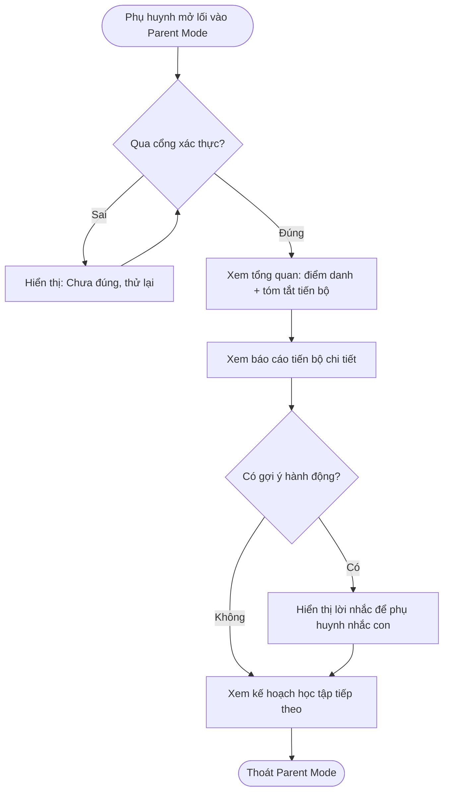

# AICNew-04 Parent Mode

---

## Metadata

| Field         | Value                                    |
|---------------|-------------------------------------------|
| **PRD ID**    | AICNew-04                                  |
| **Version**   | 1.0                                        |
| **Status**    | draft                                      |
| **Author**    | AI-assisted                                |
| **PO**        | Đặng Ngọc Lân                              |
| **Domain**    | parent-mode                                |
| **Created**   | 2026-09-14                                 |
| **Updated**   | 2026-09-14                                 |
| **Ticket**    | AICNew-04                                  |
| **API Source** |                                            |

---

# Feature

**Parent Mode**

Parent Mode là tính năng dành riêng cho phụ huynh trong Concept 1.2 (Edupia AI Class Plus), cho phép phụ huynh xem báo cáo điểm danh và tiến bộ học tập của con một cách dễ hiểu, nhận gợi ý hành động cụ thể, và nhận thông báo chủ động khi có sự kiện cần biết — thay vì phải tự đánh giá hoặc chờ báo cáo chung chung. Đây là PRD tách riêng theo đúng ranh giới đã ghi trong [AICNew-01](../../ai-class-core/big-class-plus/AICNew-01-big-class-plus.md) và [AICNew-02](../../ai-class-core/ai-bo-tro-30-phut/AICNew-02-ai-bo-tro-30-phut.md) ("Parent Mode ngoài phạm vi, thuộc PRD riêng").

> ⚠️ **Ghi chú phạm vi:** PRD này phục vụ bản demo của Concept 1.2 — một số mục còn để ngỏ (xem "Giả định AI" ở Appendix), sẽ được phân tích bổ sung khi concept được chốt chính thức.

---

# 1. Tổng quan

## a. User Story

- **Là một (As a)** phụ huynh
- **Tôi muốn (I want to)** xem báo cáo điểm danh và tiến bộ học tập của con một cách dễ hiểu, kèm gợi ý hành động cụ thể
- **Để (So that)** tôi yên tâm rằng việc học của con đang hiệu quả, mà không cần tự kèm hay tự đánh giá

## b. Phạm vi

**In Scope**
- Cổng xác thực phụ huynh (parental gate) để vào Parent Mode
- Báo cáo điểm danh: ảnh check-in/check-out, trạng thái "vào trễ"
- Báo cáo tiến bộ học tập (Mastery Map) dạng dễ hiểu (tóm tắt văn bản + biểu đồ tổng quan kỹ năng)
- Gợi ý hành động cụ thể (CTA) đi kèm mỗi chỉ số báo cáo
- Kế hoạch học tập tiếp theo (định hướng mục tiêu + lộ trình, không liệt kê mã chuyên môn)
- Thông báo chủ động tới phụ huynh khi phát sinh sự kiện cần biết

**Out of Scope**
- Dashboard hỗ trợ GVCN quản lý 1:2.000 — thuộc Concept 1.3
- Cơ chế ghi report buổi học/dữ liệu Mastery Profile gốc — thuộc [AICNew-01](../../ai-class-core/big-class-plus/AICNew-01-big-class-plus.md)/[AICNew-02](../../ai-class-core/ai-bo-tro-30-phut/AICNew-02-ai-bo-tro-30-phut.md)
- Chính sách lưu trữ/bảo mật ảnh học sinh — cần Product/Pháp lý xác lập riêng, chưa có (xem Giả định AI)
- Tài khoản/đăng nhập riêng cho phụ huynh — "tách giao diện Parent Mode hoàn toàn riêng" là định hướng tương lai, chưa áp dụng cho PRD này (xem Giả định AI)
- Trường hợp một phụ huynh có nhiều con dùng chung tài khoản — tạm hoãn (xem Giả định AI)
- Trường hợp phụ huynh không dùng Zalo/không có smartphone — để ngỏ (xem Giả định AI)

## c. Phụ thuộc liên service

- Cần "report buổi học" (điểm danh, cờ vào trễ, NLO đã gán, ảnh check-in/out) từ [AICNew-01](../../ai-class-core/big-class-plus/AICNew-01-big-class-plus.md)
- Cần kết quả buổi bổ trợ AI Tutor 30 phút từ [AICNew-02](../../ai-class-core/ai-bo-tro-30-phut/AICNew-02-ai-bo-tro-30-phut.md)
- Cần Mastery Profile/NLO từ nền tảng Adaptive Learning dùng chung toàn Edupia AI Class
- Cần chính sách lưu trữ ảnh học sinh từ Pháp lý — hiện chưa có (xem Giả định AI)

## d. Quy ước

- **Phiên xác thực Parent Mode**: trạng thái "đã qua cổng xác thực" được giữ theo phiên đăng nhập của tài khoản học sinh (Parent Mode không có phiên đăng nhập riêng cho phụ huynh) — áp dụng cho mọi BR liên quan tới cổng xác thực (§3, UC1).
- **Không giới hạn số lần thử xác thực sai**: áp dụng mặc định cho mọi lần nhập sai thử thách xác thực, không cần lặp lại ở từng BR.

---

# 2. Acceptance Criteria

**AC1:** Từ menu "Tài khoản" hoặc liên kết Zalo, hệ thống luôn hiển thị cổng xác thực trước khi cho xem bất kỳ nội dung Parent Mode nào. _(BR: AICNew-04-UC1-BR1)_

**AC2:** Phụ huynh không cần tài khoản riêng; chỉ cần vượt qua thử thách xác thực để vào Parent Mode. _(BR: AICNew-04-UC1-BR2)_

**AC3:** Nhập sai thử thách xác thực → hệ thống hiển thị "Chưa đúng, thử lại" và cho nhập lại ngay, không khoá. _(BR: AICNew-04-UC1-BR3)_

**AC4:** Thoát rồi vào lại Parent Mode trong cùng phiên đăng nhập của tài khoản học sinh → không hiện lại cổng xác thực. _(BR: AICNew-04-UC1-BR4)_

**AC5:** Buổi học chưa diễn ra hoặc report buổi học bị lỗi ghi nhận → Parent Mode hiển thị "Buổi học này chưa có báo cáo" thay vì báo cáo trống hoặc sai. _(BR: AICNew-04-UC1-BR5)_

**AC6:** Report buổi học mang cờ "thiếu ảnh điểm danh" → vị trí ảnh tương ứng hiển thị "Con chưa điểm danh {đầu buổi/cuối buổi}"; phần còn lại của báo cáo vẫn hiển thị bình thường. _(BR: AICNew-04-UC1-BR6)_

**AC7:** Mastery Profile chưa khởi tạo hoặc chưa đủ dữ liệu → Parent Mode hiển thị thông điệp khuyến khích học thêm thay vì biểu đồ/số liệu trống. _(BR: AICNew-04-UC1-BR7)_

**AC8:** Với mỗi chỉ số đã có dữ liệu trong báo cáo tiến bộ:
  - có gợi ý hành động phù hợp → hiển thị kèm một CTA tương ứng kỹ năng yếu nhất
  - không xác định được gợi ý phù hợp → không hiển thị CTA cho chỉ số đó
_(BR: AICNew-04-UC1-BR8)_

**AC9:** Khi phát sinh sự kiện (vào trễ, thiếu ảnh điểm danh, không đủ dữ liệu gán NLO, hoặc kết thúc buổi bổ trợ AI Tutor 30 phút) → phụ huynh nhận được thông báo chủ động mà không cần tự mở Parent Mode. _(BR: AICNew-04-UC2-BR10)_

**AC10:** Màn Kế hoạch học tập tiếp theo hiển thị tóm tắt mục tiêu + lộ trình gói học, không hiển thị mã đơn vị kiến thức (NLO). _(BR: AICNew-04-UC1-BR9)_

**AC11:** Toàn bộ trải nghiệm — từ qua cổng xác thực tới xem điểm danh, tóm tắt tiến bộ, CTA, và kế hoạch học tập tiếp theo — diễn ra trong một luồng liền mạch, không yêu cầu phụ huynh tự đánh giá hay tự tổng hợp thông tin. _(BR: AICNew-04-UC1-BR1, AICNew-04-UC1-BR2, AICNew-04-UC1-BR3, AICNew-04-UC1-BR4, AICNew-04-UC1-BR5, AICNew-04-UC1-BR6, AICNew-04-UC1-BR7, AICNew-04-UC1-BR8, AICNew-04-UC1-BR9, AICNew-04-UC2-BR10)_

---

# 3. Use Case

#### AICNew-04-UC1: Phụ huynh xem báo cáo và tương tác trong Parent Mode

**Actor:** Phụ huynh

**Description:** Phụ huynh mở lối vào Parent Mode (từ menu "Tài khoản" trong tài khoản học sinh, hoặc từ liên kết ngắn qua Zalo), qua cổng xác thực, rồi xem báo cáo điểm danh, báo cáo tiến bộ học tập, gợi ý hành động, và kế hoạch học tập tiếp theo của con.

**Pre-condition:**
- Tài khoản học sinh đang đăng nhập
- Report buổi học (nếu có) đã được ghi nhận từ [AICNew-01](../../ai-class-core/big-class-plus/AICNew-01-big-class-plus.md)/[AICNew-02](../../ai-class-core/ai-bo-tro-30-phut/AICNew-02-ai-bo-tro-30-phut.md)

**Post-condition:**
- Phụ huynh đã xem được báo cáo hiện có (hoặc thông điệp thay thế phù hợp nếu dữ liệu chưa sẵn sàng)
- Trạng thái "đã qua xác thực" được giữ cho tới khi tài khoản học sinh đăng xuất

**AC liên quan:** AC1, AC2, AC3, AC4, AC5, AC6, AC7, AC8, AC10, AC11

**Business Rule**

| ID | Business Rule | Business Logic |
|----|---------------|-----------------|
| AICNew-04-UC1-BR1 | Phụ huynh bấm lối vào Parent Mode (từ "Tài khoản" hoặc liên kết Zalo) → hệ thống PHẢI yêu cầu qua cổng xác thực phụ huynh trước khi hiển thị bất kỳ nội dung Parent Mode nào | - Áp dụng cho cả hai kênh vào, không có đường tắt bỏ qua cổng - Chưa đăng nhập tài khoản học sinh → không cho vào Parent Mode, quay về màn đăng nhập học sinh trước |
| AICNew-04-UC1-BR2 | Cổng xác thực PHẢI dùng chung phiên đăng nhập của tài khoản học sinh (không có tài khoản/đăng nhập riêng cho phụ huynh); PHẢI thêm một bước thử thách xác thực phụ (đọc số — viết chữ) | - Không thu thập thông tin đăng nhập riêng cho phụ huynh - Hiển thị một thử thách xác thực mỗi lần vào, không lưu để tái sử dụng |
| AICNew-04-UC1-BR3 | Nhập sai thử thách xác thực → hệ thống PHẢI cho thử lại, không giới hạn số lần (xem §1d) | - Sinh/lặp lại thử thách và cho nhập lại ngay - Thông báo: "Chưa đúng, thử lại" |
| AICNew-04-UC1-BR4 | Qua cổng xác thực thành công → chuyển vào Parent Mode; PHẢI không yêu cầu xác thực lại nếu phụ huynh thoát rồi vào lại trong cùng phiên đăng nhập | Giữ trạng thái "đã qua xác thực" trong suốt phiên đăng nhập của tài khoản học sinh |
| AICNew-04-UC1-BR5 | Buổi học chưa diễn ra hoặc report buổi học bị lỗi ghi nhận → Parent Mode PHẢI hiển thị "chưa có báo cáo" | - Điều kiện: report buổi học của buổi tương ứng không tồn tại hoặc bị đánh dấu lỗi ghi nhận - Các buổi khác không bị ảnh hưởng - Thông báo: "Buổi học này chưa có báo cáo" |
| AICNew-04-UC1-BR6 | Report buổi học có cờ "thiếu ảnh điểm danh" → Parent Mode PHẢI hiển thị "con chưa điểm danh" tại đúng vị trí (đầu hoặc cuối buổi) | - Thay vị trí ảnh bằng thông điệp, không chặn phần còn lại của báo cáo - Thông báo: "Con chưa điểm danh {đầu buổi/cuối buổi}" |
| AICNew-04-UC1-BR7 | Mastery Profile chưa khởi tạo hoặc chưa đủ dữ liệu → Parent Mode PHẢI hiển thị thông điệp khuyến khích thay vì Mastery Map trống hoặc gây hiểu lầm | - Thay toàn bộ khối báo cáo tiến bộ bằng thông điệp khuyến khích, không hiển thị biểu đồ/số liệu rỗng - Thông báo: "Chưa đủ dữ liệu để đánh giá kết quả học tập của con — khuyến khích con học thêm bài để hệ thống có đủ dữ liệu đánh giá" |
| AICNew-04-UC1-BR8 | Mỗi chỉ số trong báo cáo tiến bộ đã có dữ liệu PHẢI đi kèm một gợi ý hành động (CTA); CTA là lời nhắc để phụ huynh nhắc con, KHÔNG phải hành động phụ huynh tự làm thay con | - Xác định gợi ý hành động theo kỹ năng yếu nhất của chỉ số đó - Không xác định được gợi ý phù hợp → ẩn CTA cho chỉ số đó, không hiển thị CTA rỗng |
| AICNew-04-UC1-BR9 | Kế hoạch học tập tiếp theo hiển thị cho phụ huynh PHẢI ở dạng tóm tắt mục tiêu + lộ trình gói học, KHÔNG liệt kê mã đơn vị kiến thức (NLO) chi tiết | Tổng hợp từ mục tiêu hiện tại + gói học đang theo, diễn đạt thành câu tóm tắt nghiệp vụ |

> **Note BR2:** Parent Mode hiện KHÔNG tách thành giao diện/tài khoản hoàn toàn riêng cho phụ huynh — quyết định PO 2026-09-14 giữ nguyên phương án nhúng trong tài khoản học sinh; "tách giao diện riêng" là định hướng đang cân nhắc cho tương lai (xem Giả định AI Q5).
>
> **Note BR3:** Không giới hạn số lần nhập sai — quyết định PO 2026-09-14, ưu tiên trải nghiệm phụ huynh hơn là chặn brute-force ở bước này.

---

#### AICNew-04-UC2: Hệ thống gửi thông báo chủ động tới phụ huynh

**Actor:** Hệ thống (kích hoạt tự động); Phụ huynh (người nhận)

**Description:** Khi report buổi học hoặc kết quả buổi bổ trợ AI Tutor 30 phút phát sinh một sự kiện cần biết, hệ thống chủ động gửi thông báo tới phụ huynh mà không cần phụ huynh tự mở Parent Mode.

**Pre-condition:**
- Report buổi học (từ [AICNew-01](../../ai-class-core/big-class-plus/AICNew-01-big-class-plus.md)) hoặc kết quả buổi bổ trợ (từ [AICNew-02](../../ai-class-core/ai-bo-tro-30-phut/AICNew-02-ai-bo-tro-30-phut.md)) đã được ghi nhận, mang một trong các cờ sự kiện

**Post-condition:**
- Phụ huynh nhận được thông báo tương ứng mà không cần tự mở Parent Mode

**AC liên quan:** AC9, AC11

**Business Rule**

| ID | Business Rule | Business Logic |
|----|---------------|-----------------|
| AICNew-04-UC2-BR10 | Khi report buổi học/kết quả buổi bổ trợ ghi nhận một cờ sự kiện (vào trễ, thiếu ảnh điểm danh, không đủ dữ liệu gán NLO), hoặc buổi bổ trợ AI Tutor 30 phút kết thúc → hệ thống PHẢI gửi thông báo chủ động tới phụ huynh của học sinh đó | Kích hoạt gửi thông báo ngay khi cờ sự kiện được ghi nhận, không yêu cầu phụ huynh tự mở Parent Mode mới biết |

> **Note BR10:** Hành vi khi gửi thông báo **thất bại** (thử lại / bỏ qua / chỉ hiển thị lại khi phụ huynh tự mở Parent Mode lần sau) **chưa được PO chốt** — xem Giả định AI Q1.

---

# 4. UI/UX Guidelines

## a. User Flow

## b. Wireframe

| Màn hình | Thành phần chính | Hành động → kết quả nghiệp vụ |
|---|---|---|
| Cổng xác thực phụ huynh | Thử thách xác thực (đọc số — viết chữ) | Nhập đúng → vào Parent Mode; sai → thử lại không giới hạn _(AICNew-04-UC1-BR2, BR3)_ |
| Parent Mode — Tổng quan | Ảnh check-in/out, tóm tắt điểm danh, tóm tắt tiến bộ | Bấm mục → xem chi tiết tương ứng |
| Báo cáo tiến bộ chi tiết | Tóm tắt văn bản, biểu đồ tổng quan kỹ năng (chi tiết hình dạng biểu đồ thuộc Design Spec), nút gợi ý hành động | Bấm gợi ý hành động → hiển thị lời nhắc cho phụ huynh _(AICNew-04-UC1-BR8)_ |
| Kế hoạch học tập tiếp theo | Tóm tắt mục tiêu + lộ trình gói học | Chỉ xem, không có thao tác khác _(AICNew-04-UC1-BR9)_ |

---

# Appendix

## Giả định AI *(cần PO chốt trước khi bàn giao dev chính thức)*

- **Q1 — [AI DRAFT]:** Khi gửi thông báo chủ động (AICNew-04-UC2-BR10) thất bại, hệ thống nên thử gửi lại, bỏ qua, hay chỉ hiển thị lại khi phụ huynh tự mở Parent Mode lần sau? PO quyết định xử lý sau ở `/refine-prd` (tài liệu này phục vụ bản demo).
- **Q2 — [AI DRAFT]:** Chính sách lưu trữ/bảo mật ảnh học sinh (check-in/out) — thời hạn lưu, phạm vi truy cập, đồng ý phụ huynh — chưa được định nghĩa ở bất kỳ PRD nào. Cần Product/Pháp lý xác lập trước khi Parent Mode hiển thị ảnh học sinh chính thức.
- **Q3 — [AI DRAFT]:** Trường hợp một phụ huynh có nhiều con dùng chung tài khoản — PO chủ động tạm hoãn, chưa xử lý ở PRD này.
- **Q4 — [AI DRAFT]:** Trường hợp phụ huynh không dùng Zalo/không có smartphone — PO để ngỏ, chưa xử lý ở PRD này.
- **Q5 — [AI DRAFT]:** Định hướng "Parent Mode tách giao diện hoàn toàn riêng khỏi tài khoản học sinh" — PO xác nhận đây là định hướng đang cân nhắc, chưa phải quyết định. Nếu được chốt trong tương lai, PRD này cần được xét lại toàn bộ (đặc biệt UC1-BR1/BR2 — cơ chế xác thực đang giả định dùng chung phiên đăng nhập học sinh).

## Tài liệu tham khảo

- [AICNew-01 — Big Class Plus](../../ai-class-core/big-class-plus/AICNew-01-big-class-plus.md) — nguồn "report buổi học"
- [AICNew-02 — AI Bổ trợ 30 phút](../../ai-class-core/ai-bo-tro-30-phut/AICNew-02-ai-bo-tro-30-phut.md) — nguồn kết quả buổi bổ trợ
- `00_context/AICNew-04-parent-mode.md` — Product Definition (Phase 0-7) làm nguồn cho PRD này
- `03_product/concepts/tong-hop-nhu-cau-jtbd-pain-point-concept-1.2-2026-09-14.md` — tổng hợp nhu cầu/JTBD/pain point phụ huynh
- `00_context/meeting-notes/2026-09-10-review-demo-concept-1-2.md` — feedback thiết kế Parent Mode (Mastery Map, CTA, ảnh điểm danh)
- `06_decisions/decision-log.md` — `D-2026-09-14-01` (phạm vi Mastery Profile/Parent Mode)
